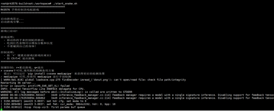
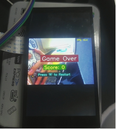

All of the project modifications in this article are based mainly on compatibility, smoothness, screen display method, and camera invocation.

## Display Output Adaptation

### Main Adaptation Issues

#### 1. RK3576 Runs a Pure Wayland Environment

RK3576 runs a pure Wayland environment with no X11 or libGL support, so the traditional `cv2.imshow()` cannot be used to display images.

**[Solution]**

Adopt the FIFO + GStreamer + Wayland display pipeline:

```python
# Python side code
fifo = open('/tmp/gesture_fifo', 'wb')
while True:
    _, jpeg = cv2.imencode('.jpg', processed_frame,
                [cv2.IMWRITE_JPEG_QUALITY, 85])
    fifo.write(jpeg.tobytes())
    fifo.flush()
```

```bash
# Shell side code
# GStreamer reads the JPEG stream from the pipe and displays it
gst-launch-1.0 filesrc location=/tmp/gesture_fifo ! \
    jpegparse ! jpegdec ! videoconvert ! waylandsink fullscreen=true
```

#### 2. IMX415 Camera Color Anomaly on Second Launch

The IMX415 camera shows a color anomaly on its second launch, with the kernel reporting the error "no first iq setting".

**[Solution]**

Restart rkaiq_3A_server before each camera open:

```python
def restart_3a(self):
    os.system("killall rkaiq_3A_server 2>/dev/null")
    time.sleep(2)
    os.system("rm -f /tmp/.rkaiq_3A* 2>/dev/null")
    os.system("/etc/init.d/S40rkaiq_3A start >/dev/null 2>&1")
    time.sleep(5)
```

## Project 1: Snake Game

Open-source project address: [Project2/SnakeGame/main.py at main · WLHSDXN/Project2](https://github.com/WLHSDXN/Project2/blob/main/SnakeGame/main.py)

### Modification Process

#### 1. Multi-Layer Detector Architecture

To accommodate different dependency environments, a three-layer detector fallback mechanism was designed:

```
Priority 1: cvzone (MediaPipe wrapper, high accuracy)
  ↓ unavailable
Priority 2: native MediaPipe (21 keypoints)
  ↓ unavailable
Priority 3: HSV skin-color detection (lightweight fallback)
```

Code implementation:

```python
# Detector selection logic
if USE_CVZONE:
    detector = CvzoneHandDetector(detectionCon=0.8, maxHands=1)
elif USE_MEDIAPIPE:
    detector = MediapipeHandDetector(maxHands=1,
                    detectionCon=0.5,
                    drawLandmarks=False)
else:
    detector = SimpleHandDetector()  # HSV fallback solution
```

#### 2. MediaPipe Integration and Wrapping

Implemented the MediapipeHandDetector class, returning a data format compatible with cvzone:

```python
class MediapipeHandDetector:
    def findHands(self, frame, flipType=False):
        img_rgb = cv2.cvtColor(frame, cv2.COLOR_BGR2RGB)
        results = self.hands.process(img_rgb)

        hands = []
        if results.multi_hand_landmarks:
            for hand_landmarks in results.multi_hand_landmarks:
                # Extract 21 keypoint coordinates
                lmList = []
                for lm in hand_landmarks.landmark:
                    x_px = int(lm.x * width)
                    y_px = int(lm.y * height)
                    lmList.append([x_px, y_px, lm.z])

                hands.append({'lmList': lmList})

        return hands, frame
```

**[Key Point]**

The index fingertip is lmList[8], used directly as the snake-head control point.

#### 3. HSV Skin-Color Detection Fallback

When MediaPipe is unavailable, use simple skin-color detection:

```python
def detect_hand_simple(frame):
    hsv = cv2.cvtColor(frame, cv2.COLOR_BGR2HSV)
    mask = cv2.inRange(hsv, [0, 30, 60], [255, 255, 255])

    # Morphological denoising
    kernel = np.ones((7, 7), np.uint8)
    mask = cv2.morphologyEx(mask, cv2.MORPH_CLOSE, kernel, iterations=3)
    mask = cv2.morphologyEx(mask, cv2.MORPH_OPEN, kernel, iterations=2)

    contours, _ = cv2.findContours(mask, cv2.RETR_EXTERNAL,
                    cv2.CHAIN_APPROX_SIMPLE)
    if contours:
        c = max(contours, key=cv2.contourArea)
        hull = cv2.convexHull(c)
        # Extract the topmost point as the "fingertip"
        topmost = hull[hull[:, :, 1].argmin()][0]
        return topmost
```

#### 4. MediaPipe Performance Tuning

##### Optimization 1: Use a Lightweight Model

```python
self.hands = mp.solutions.hands.Hands(
    model_complexity=0,  # 0=lite, 1=full (default)
    max_num_hands=1,
    min_detection_confidence=0.5,  # lower threshold for speed
    min_tracking_confidence=0.5
)
```

##### Optimization 2: Disable Visualization Drawing

```python
# Remove the time-consuming keypoint drawing
# mp_drawing.draw_landmarks(frame, landmarks, connections)  # commented out
drawLandmarks=False  # new switch
```

##### Optimization 3: Reduce Input Resolution

```python
# 640x480 is already the optimal balance point
# Lowering further to 320x240 can boost FPS, but hurts detection accuracy
cap.set(cv2.CAP_PROP_FRAME_WIDTH, 640)
cap.set(cv2.CAP_PROP_FRAME_HEIGHT, 480)
```

##### Optimization 4: Optimize the Camera Buffer

```python
cap.set(cv2.CAP_PROP_BUFFERSIZE, 1)  # reduce latency
```

**[Optimization Effect]**

FPS increased from 5-10 to 15-25 FPS, meeting the needs of game interaction.

#### 5. File-Based Control Interface

Because keyboard input cannot be captured directly in FIFO mode, a control-file approach is used:

```bash
# Shell script section
# Read keypresses and write control files
stty echo icanon
while read n1 t 0.1 key; do
    if [ "$key" = "r" ]; then
        touch /tmp/snake_restart
    elif [ "$key" = "q" ]; then
        touch /tmp/snake_quit
    fi
done
```

```python
# Python section
# Detect control files
if os.path.exists('/tmp/snake_quit'):
    print('Quit command detected')
    break

if os.path.exists('/tmp/snake_restart'):
    os.remove('/tmp/snake_restart')
    # Reset game state
    self.game.gameOver = False
    self.game.points = []
    self.game.previousHead = (0, 0)
```

#### Effect Demonstration

The code and demo video are in the attachments.





## Project 2: Virtual Drawing Board

Open-source project: [Based on hand keypoint detection, air-control the mouse / air-draw] https://www.bilibili.com/video/BV1364y1h7PS?vd_source=a16ca768198c38baa684546cf5060811

### Modification Process

#### 1. Core Logic Extraction

##### Gesture Recognition Logic:

```python
fingers = detector.fingersUp()  # returns 5 values, 1 means finger extended

# Mode 1: select tool (index + middle finger extended)
if fingers[1] and fingers[2]:
    if y1 < 153:  # in the top toolbar area
        if 0 < x1 < 320:    color = [50, 128, 250]  # blue
        elif 320 < x1 < 640:  color = [0, 0, 255]    # red
        elif 640 < x1 < 960:  color = [0, 255, 0]    # green
        elif 960 < x1 < 1280: color = [0, 0, 0]     # eraser

# Mode 2: draw (only index finger extended)
elif fingers[1] and not fingers[2]:
    cv2.line(imgCanvas, (xp, yp), (x1, y1), color, brushThickness)
```

##### Canvas Compositing Logic:

```python
# 1. Convert the canvas to grayscale and binarize it
imgGray = cv2.cvtColor(imgCanvas, cv2.COLOR_BGR2GRAY)
_, imgInv = cv2.threshold(imgGray, 50, 255, cv2.THRESH_BINARY_INV)

# 2. Composite with bitwise operations
img = cv2.bitwise_and(img, imgInv)    # keep non-drawing area of camera frame
img = cv2.bitwise_or(img, imgCanvas)   # overlay drawing content
```

#### 2. Display System Rebuild

Reuse the snake game's display solution: FIFO + GStreamer.

#### 3. Toolbar Internalization

The original project depended on 4 PNG images as the toolbar, which is inconvenient for managing external resources on an embedded system.

**[Solution]**

Generate the toolbar with OpenCV drawing APIs:

```python
def create_header(self):
    """Dynamically generate the toolbar"""
    header = np.zeros((100, self.width, 3), np.uint8)
    header[:] = (200, 200, 200)  # gray background

    tools = [
        ((250, 128, 50), "Blue"),  # BGR format
        ((0, 0, 255), "Red"),
        ((0, 255, 0), "Green"),
        ((0, 0, 0), "Eraser")
    ]

    section_width = self.width // 4
    for i, (color, label) in enumerate(tools):
        x1 = i * section_width
        x2 = (i + 1) * section_width

        # Draw color block
        cv2.rectangle(header, (x1 + 10, 20), (x2 - 10, 80), color, -1)
        cv2.rectangle(header, (x1 + 10, 20), (x2 - 10, 80),
               (255, 255, 255), 2)  # white border

        # Text label
        cv2.putText(header, label, (x1 + 20, 95),
              cv2.FONT_HERSHEY_SIMPLEX, 0.5, (50, 50, 50), 1)

    return header
```

This way there is zero dependency on external resources, which is better for porting and project development!

#### 4. Camera and 3A Service Adaptation

Reuse the snake game's fix.

#### 5. Resolution vs. Performance Trade-off

**[Original Configuration]**:

```python
width = 1280, height = 720
canvas: imgCanvas = np.zeros((720, 1280, 3), np.uint8)
```

**[RK3576 Optimization]**

```python
width = 640, height = 480  # reduce resolution by 50%
canvas: imgCanvas = np.zeros((480, 640, 3), np.uint8)
```

**[Reasons]**

1. MediaPipe's FPS roughly doubles at 640x480
2. The drawing-board application does not demand as high a resolution as vision recognition
3. JPEG encoding/transmission is faster

**[Toolbar Adaptation]**

Original: 153 pixels tall at the top, divided into 4 regions 320 pixels wide
RK3576: 100 pixels tall at the top, divided into 4 regions 160 pixels wide

```python
section_width = self.width // 4  # adaptive width
if y1 < 100:  # toolbar height
    if 0 < x1 < section_width:
        self.color = (250, 128, 50)  # blue
    elif section_width < x1 < section_width * 2:
        self.color = (0, 0, 255)   # red
# ...
```

#### 6. Interaction Control Improvements

##### 1. Clear-Canvas Mechanism

**[Original]**

```python
if all(x >= 1 for x in fingers):
    imgCanvas = np.zeros((720, 1280, 3), np.uint8)
```

**[Problem]**

High false-trigger rate; inconvenient for fine control.

**[RK3576 Improvement]**

Use keypress control:

```bash
# Shell side
while read -n1 -t 0.1 key; do
    if [ "$key" = "c" ]; then
        touch /tmp/painter_clear
    fi
done
```

```python
# Python side
if os.path.exists('/tmp/painter_clear'):
    os.remove('/tmp/painter_clear')
    self.imgCanvas = np.zeros((self.height, self.width, 3), np.uint8)
    print("Canvas cleared")
```

##### 2. Exit Control

**[Original]**

Can only capture the keyboard through `cv2.waitKey(1)`, dependent on window focus.

**[RK3576]**

Dual exit mechanism:

1. Keypress control:
   touch /tmp/painter_quit -> Python detects it and exits

2. Ctrl+C:
   Shell script traps the signal -> kills all processes -> cleans up the FIFO

#### Effect Demonstration

The code and demo video are in the attachments.


## Technical Summary and Lessons

1. **Cross-Platform Display Adaptation**
   PC GUI solutions do not apply to embedded systems; the output method must be chosen based on system characteristics (Wayland/Framebuffer).

2. **Resource Internalization**
   Embedded systems tend toward single-file deployment; external resources should be turned into code-generated content or packed into the program.

3. **Tiered Performance Optimization**
   - Algorithm layer: lightweight models
   - Implementation layer: disable non-essential drawing
   - Hardware layer: buffer/resolution tuning

4. **Interaction Adaptation**
   Keyboard/mouse events that GUIs depend on must be converted to file control or GPIO triggers.