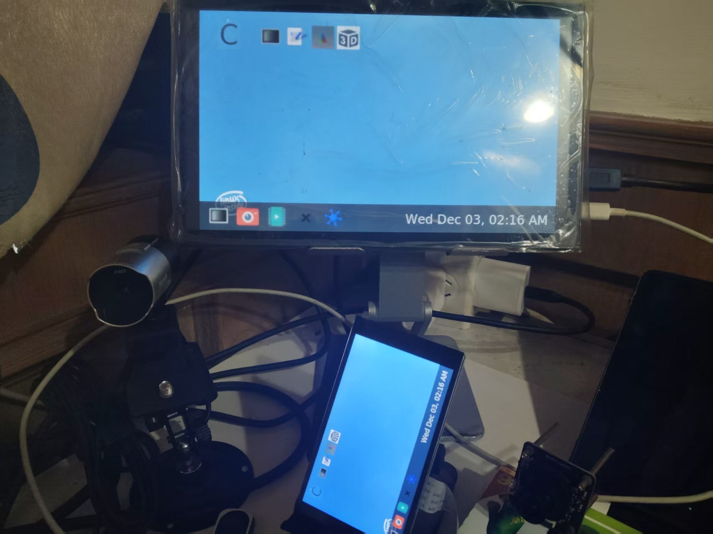
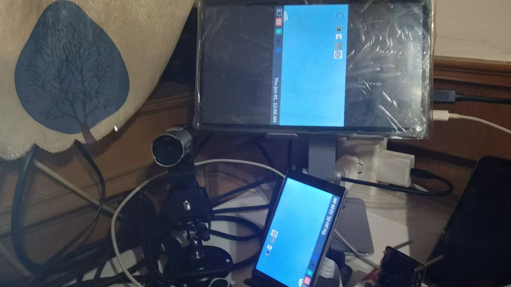

In embedded system development, display configuration is the foundation for implementing user interfaces. Weston, as the reference implementation of the Wayland compositor, is widely used in embedded devices and desktop environments. Faced with different hardware configurations and application scenarios, precise control of display output is required. Below, based on the DshanPI-A1 buildroot firmware version, we provide Weston configuration methods for three typical scenarios: single-screen exclusive, dual-screen mirrored, and dual-screen extended display, along with a detailed operation guide.

## Weston Architecture and Configuration Principles

Before configuration, it helps to briefly understand the basic principles.

### Weston Display System Architecture

Weston adopts a modular design; its core components include:

-   **Backend**: Responsible for interacting with the underlying graphics system, such as DRM, X11, Wayland, etc.
-   **Compositor**: Manages window compositing, rendering, and output
-   **Shell**: Provides the user interface framework, such as desktop, panel, etc.

In embedded systems, the DRM backend drm-backend.so is typically used; it directly interacts with the Linux kernel's Direct Rendering Manager, providing efficient hardware acceleration support.

###  Configuration File Structure

Weston's main configuration file is located at `/etc/xdg/weston/weston.ini` and is organized in INI format. The key configuration sections include:

-   `[core]`: Core configuration, defines backend behavior and global parameters
-   `[output]`: Display output configuration, controls the properties of each physical interface
-   `[shell]`: Desktop environment related settings
-   `[libinput]`: Input device configuration
-   `[device]`: Advanced configuration for specific devices

## HDMI Exclusive Display Configuration

In some embedded application scenarios, the device needs to force the HDMI interface as the only display output while disabling the built-in screen (such as the DSI-interface LCD). This configuration is common in:

-   Industrial consoles permanently connected to external monitors
-   Digital signage systems using large-screen displays
-   Professional applications requiring high-resolution output

The following is the detailed configuration:

**First, configure the environment variables**

```bash
export WESTON_DRM_MIRROR=false
export WESTON_DRM_PREFER_EXTERNAL=0
export WESTON_DRM_SINGLE_HEAD=0
export WESTON_DRM_MASTER_OUTPUT="HDMI-A-1"
```

**Then write to /etc/xdg/weston/weston.ini**

```ini
[core]
backend=drm-backend.so
require-input=true         # Must connect an input device to start
require-outputs=true       # Must detect output devices
idle-time=0                # Disable screen sleep
repaint-window=16          # Repaint window, ~60Hz refresh rate

# Disable auto-detection
use-udev=false             # Turn off udev auto-detection, manually control output

[output]
name=HDMI-A-1             # Specify the HDMI-A-1 interface
mode=1920x1080@60         # 1080p resolution, 60Hz refresh rate
transform=normal          # No rotation transform
scale=1.5                 # 150% scaling, adapts to high DPI

# Disable DSI interface
[output]
name=DSI-1
mode=off                  # Turn off this output

[shell]
panel-scale=2             # Panel elements 200% scaling
cursor-size=32            # Mouse pointer size
locking=false             # Disable screen locking
startup-animation=none    # Disable startup animation

[keyboard]
vt-switching=true         # Allow virtual terminal switching

[libinput]
touchscreen_calibrator=true  # Enable touchscreen calibration
enable-tap=true           	 # Enable tap gesture
natural-scroll=true          # Natural scroll direction

[device]
name=wch.cn USB2IIC_CTP_CONTROL   # Specific touch device
rotation=normal                   # Normal orientation
```

### Test

Boot


Run 3D test


In practical applications, the DSI driver output should be turned off


### Tips: Note, there's a pitfall here that prevented my HDMI screen from starting at first

Look at this Weston startup output log:

```bash
root@rk3576-buildroot:/# weston
Date: 2025-12-03 UTC
..........
[03:20:26.528] Output HDMI-A-1 (crtc 72) video modes:
               1024x600@59.8, preferred, 50.2 MHz
               1920x1080@60.0 16:9, 148.5 MHz
               1920x1080@59.9 16:9, 148.4 MHz
               1920x1080i@60.0, 74.2 MHz
               1920x1080i@60.0 16:9, 74.2 MHz
               1920x1080i@59.9 16:9, 74.2 MHz
               1920x1080@50.0, current, 148.5 MHz
               1920x1080@50.0 16:9, 148.5 MHz
               1920x1080i@50.0, 74.2 MHz
               1920x1080i@50.0 16:9, 74.2 MHz
               1280x1024@75.0, 135.0 MHz
               1280x720@60.0 16:9, 74.2 MHz
               1280x720@59.9 16:9, 74.2 MHz
               1280x720@50.0, 74.2 MHz
               1280x720@50.0 16:9, 74.2 MHz
               1024x768@75.0, 78.8 MHz
               1024x768@70.1, 75.0 MHz
               1024x768@60.0, 65.0 MHz
               832x624@74.6, 57.3 MHz
               800x600@75.0, 49.5 MHz
               800x600@72.2, 50.0 MHz
               800x600@60.3, 40.0 MHz
               800x600@56.2, 36.0 MHz
               720x576@50.0, 27.0 MHz
               720x576@50.0 4:3, 27.0 MHz
               720x576@50.0 16:9, 27.0 MHz
               720x480@60.0 4:3, 27.0 MHz
               720x480@60.0 16:9, 27.0 MHz
               720x480@59.9 4:3, 27.0 MHz
               720x480@59.9 16:9, 27.0 MHz
               640x480@75.0, 31.5 MHz
               640x480@72.8, 31.5 MHz
               640x480@60.0 4:3, 25.2 MHz
               640x480@59.9, 25.2 MHz
               720x400@70.1, 28.3 MHz
.....
```

Note this resolution

1024x600@59.8, preferred, 50.2 MHz is my screen's actual physical resolution and the default configuration. If you directly configure

```ini
# Force-specify output
[output]
name=HDMI-A-1
#mode=1920x1080@50
mode=1024x600@59.8
transform=normal
scale=1.5
```

At startup:

```bash
xkbcommon: ERROR: couldn't find a Compose file for locale "en_US.UTF-8" (mapped to "en_US.UTF-8")
could not create XKB compose table for locale 'en_US.UTF-8'.  Disabiling compose
xkbcommon: ERROR: couldn't find a Compose file for locale "en_US.UTF-8" (mapped to "en_US.UTF-8")
could not create XKB compose table for locale 'en_US.UTF-8'.  Disabiling compose
[  695.260819] dwhdmi-rockchip 27da0000.hdmi: use tmds mode
[  695.279593] rockchip-vop2 27d00000.vop: [drm:vop2_crtc_atomic_enable] Update mode to 1024x600p60, type: 11(if:HDMI0, flag:0x0) for vp0 dclk: 50250000
[  695.279636] rockchip-hdptx-phy-hdmi 2b000000.hdmiphy: hdptx_ropll_cmn_config bus_width:7aae4 rate:1485000
[  695.279810] rockchip-hdptx-phy-hdmi 2b000000.hdmiphy: hdptx phy pll locked!
[  695.279872] rockchip-hdptx-phy-hdmi 2b000000.hdmiphy: hdptx_ropll_cmn_config bus_width:7aae4 rate:502500
[  695.280061] rockchip-hdptx-phy-hdmi 2b000000.hdmiphy: hdptx phy pll locked!
[  695.280069] rockchip-vop2 27d00000.vop: [drm:vop2_crtc_atomic_enable] set dclk_vp0 to 50250000, get 50250000
[  695.280120] dwhdmi-rockchip 27da0000.hdmi: final tmdsclk = 50250000
[  695.280189] dwhdmi-rockchip 27da0000.hdmi: don't use dsc mode
[  695.280198] dwhdmi-rockchip 27da0000.hdmi: dw hdmi qp use tmds mode
[  695.280206] rockchip-hdptx-phy-hdmi 2b000000.hdmiphy: bus_width:0x7aae4,bit_rate:502500
[  695.285263] rockchip-hdptx-phy-hdmi 2b000000.hdmiphy: hdptx phy lane can't ready!
[  695.285271] phy phy-2b000000.hdmiphy.4: phy poweron failed --> -22
[  695.285278] dwhdmi-rockchip 27da0000.hdmi: dw_hdmi_qp_setup hdmi set operation mode failed
[  695.285317] dwhdmi-rockchip 27da0000.hdmi: Rate 50250000 missing; compute N dynamically
[  695.286726] dwhdmi-rockchip 27da0000.hdmi: Rate 50250000 missing; compute N dynamically
[  695.315462] dwhdmi-rockchip 27da0000.hdmi: use tmds mode

```

Note:

```bash
[  695.285263] rockchip-hdptx-phy-hdmi 2b000000.hdmiphy: hdptx phy lane can't ready!
[  695.285271] phy phy-2b000000.hdmiphy.4: phy poweron failed --> -22
```

**The screen cannot start, so here's a lesson learned:**

**When testing a screen, the physical resolution may be incompatible; you need to test multiple resolutions to find a compatible one.**

### Key Configuration Points

**Importance of use-udev=false**:
		By default, Weston auto-detects all connected display devices via udev. When set to `false`, Weston will only use the outputs explicitly specified in the configuration file, providing the basis for precise control.

**Output Priority Control**:
		When multiple `[output]` sections exist, Weston processes them in the order they appear in the configuration file. Placing the outputs to be disabled after the active output and setting `mode=off` ensures correct display control.

**Scaling Configuration Strategy**:
		Embedded devices often need to adjust the physical size of UI elements. The `scale` parameter allows you to independently control the scaling ratio of each output, which is especially important when connecting monitors with different DPIs.

## DSI Exclusive Mode

Opposite to HDMI exclusive, some applications need to use only the device's built-in screen, such as:

-   Mobile devices or portable instruments
-   Battery-powered devices that conserve power
-   Application scenarios that don't need external displays

**/etc/xdg/weston/weston.ini**

```ini
[core]
backend=drm-backend.so

# Allow running without input devices
require-input=false

# Allow running without output devices
require-outputs=none

# Disable screen idle timeout by default
idle-time=0

# Key: Disable auto-detection of all connections
use-udev=false

# The repaint-window is used to calculate repaint delay(ms) after flipped.
#   value <= 0: delay = abs(value)
#   value > 0: delay = vblank_duration - value
repaint-window=-1

# Allow blending with lower drm planes
# gbm-format=argb8888

[shell]
# top(default)|bottom|left|right|none, none to disable panel
# panel-position=none

# Scale panel size
panel-scale=2

# Set cursor size
cursor-size=32

# none|minutes(default)|minutes-24h|seconds|seconds-24h
# clock-format=minutes-24h
clock-with-date=false

# Disable screen locking
locking=false

# Disable the desktop starting up animation
startup-animation=none

[libinput]
# Uncomment below to enable touch screen calibrator(weston-touch-calibrator)
# touchscreen_calibrator=true
# calibration_helper=/bin/weston-calibration-helper.sh

[keyboard]
# Comment this to enable vt switching
vt-switching=false

# Configs for auto key repeat
# repeat-rate=40
# repeat-delay=400
[output]
name=DSI-1
mode=480x800
transform=rotate-180
scale=0.2

# Explicitly disable DSI-1
[output]
name=HDMI-A-1
mode=off
```
### Test

Boot


Run 3D test


### Key Points

**Rotation Configuration**:
		The screen mounting orientation of embedded devices may differ. The `transform` parameter supports multiple rotation options:

-   `normal`: No rotation
-   `rotate-90`: 90 degrees clockwise
-   `rotate-180`: 180 degrees
-   `rotate-270`: 270 degrees clockwise
-   `flipped`: Horizontal flip
-   `flipped-rotate-180`: Combined transform

**DPI Adaptation Strategy**:
		Small, high-resolution screens require appropriate UI scaling. By experimenting with different `scale` values, find a UI element size with suitable physical dimensions. This configuration uses 0.2 (20%) scaling to ensure UI elements can be operated normally at 480x800 resolution.

## Dual-Screen Mirrored Display

Dual-screen mirrored display (mirror mode) is suitable for:

-   Demonstration and teaching scenarios
-   Synchronized display between the main console and an observation screen
-   Troubleshooting and debugging

**/etc/xdg/weston/weston.ini**

```ini
[core]
backend=drm-backend.so
require-input=true
require-outputs=true
idle-time=0
repaint-window=16
mode=mirror
use-udev=true  # Dual-screen requires udev enabled

[output]
name=HDMI-A-1
mode=1920x1080
transform=rotate-270
scale=0.25

[output]
name=DSI-1
mode=1920x1080
transform=rotate-270
scale=0.25

[shell]
panel-scale=2
cursor-size=32
locking=false
startup-animation=none

[keyboard]
vt-switching=true

[libinput]
touchscreen_calibrator=true
enable-tap=true
natural-scroll=true

# Key fix: explicitly bind the touch device to HDMI output
[device]
name=wch.cn USB2IIC_CTP_CONTROL
output=HDMI-A-1  # Explicitly specify the HDMI screen
rotation=normal  # Adjust according to actual orientation
```
### Test

Boot



Run 3D test


### Key Points

**Resolution Alignment**:
		In mirror mode, the two outputs should use the same resolution; otherwise Weston will display at the lower resolution or scaled. This configuration uniformly uses 1920x1080 to ensure consistent display content.

**Touch Input Binding**:
		In a multi-screen environment, touch input needs to be explicitly bound to a specific screen. The `output=HDMI-A-1` configuration ensures touch operations only affect the HDMI display, avoiding confusion in mirror mode.

**Performance Optimization Considerations**:
		Mirror mode requires the compositor to render the same content twice, which has some impact on system performance. Properly adjusting the `repaint-window` parameter can balance smoothness and system load.

## Dual-Screen Extended Display

Dual-screen extended display (extend mode) is suitable for:

-   Multi-tasking work environments
-   Separation of control panel and data display
-   Complex professional application interfaces

The following is the configuration

**weston.ini configuration**

```ini
[core]
backend=drm-backend.so
require-input=true
require-outputs=true
idle-time=0
repaint-window=16
mode=extend  # Key: change to extend mode
use-udev=true

# HDMI screen (right side)
[output]
name=HDMI-A-1
mode=1920x1080
transform=rotate-270
scale=0.25
x=200  # DSI on the left, starting from DSI width
y=0

# DSI screen (left side)
[output]
name=DSI-1
mode=480x800
transform=rotate-270
scale=0.25
x=0
y=0

[shell]
panel-scale=2
cursor-size=32
locking=false
startup-animation=none

[keyboard]
vt-switching=true

[libinput]
touchscreen_calibrator=true
enable-tap=true
natural-scroll=true

[device]
name=wch.cn USB2IIC_CTP_CONTROL
output=HDMI-A-1  # Touch bound to HDMI screen
rotation=normal
```

### Test

At startup



Need to set environment variables to turn off mirror mode

```bash
# Environment variables
export WESTON_DRM_MIRROR=0         # Turn off mirror mode
export WESTON_DRM_PREFER_EXTERNAL=0 # Don't prefer external display
export WESTON_DRM_SINGLE_HEAD=0     # Enable multi-head support
pkill weston
weston &
```


After startup, the system recognizes two independent monitors, and the desktop can extend across screens. Each screen can run different applications, achieving a true multi-tasking environment.

### Key Points

**Screen Layout Control**:
		Weston's default screen layout may not match the actual physical layout. You can optimize it via the position parameters in `weston.ini` or by manually adjusting after startup.

**Cross-Screen Window Management**:
		In extend mode, windows can be moved between screens. You need to ensure the window manager and applications support the multi-screen environment.

**Performance Considerations**:
		Extend mode demands more graphics performance, especially when the two screens have very different resolutions. Rendering settings need to be adjusted based on hardware capabilities.

## Summary

Although Weston multi-screen configuration has some complexity, by deeply understanding its configuration principles and mastering the key parameters, you can achieve highly customized display solutions. Whether single-screen exclusive, dual-screen mirrored, or dual-screen extended, you need to comprehensively consider hardware characteristics, application requirements, and user experience.

In the actual configuration process, it is recommended to take an incremental testing approach: **start from the basic configuration, verify individual functions, then gradually add complex features.**
