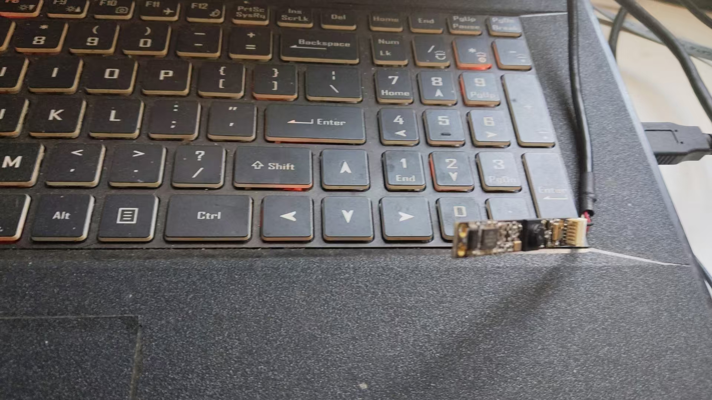
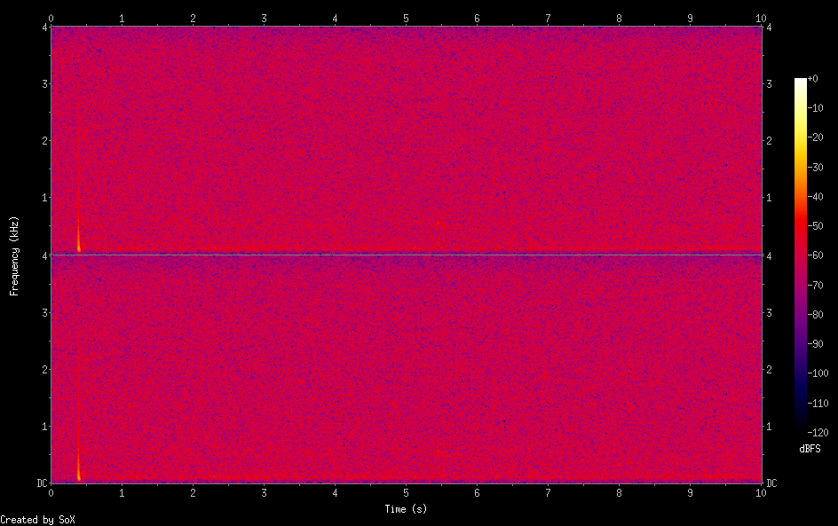
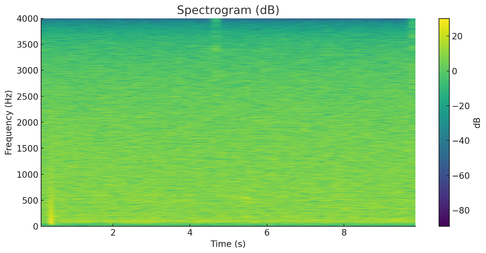

## Audio Playback

### Speaker Device

Let's first look at how to use this speaker. First, list the audio playback devices.

```bash
aplay -l
    **** List of PLAYBACK Hardware Devices ****
    card 0: rockchipes8388 [rockchip-es8388], device 0: dailink-multicodecs ES8323 HiFi-0 [dailink-multicodecs ES8323 HiFi-0]
      Subdevices: 1/1
      Subdevice #0: subdevice #0
    card 1: rockchiphdmiin [rockchip,hdmiin], device 0: 2a640000.sai-dummy_codec dummy_codec-0 [2a640000.sai-dummy_codec dummy_codec-0]
      Subdevices: 1/1
      Subdevice #0: subdevice #0
    card 2: rockchipdp0 [rockchip-dp0], device 0: rockchip-dp0 spdif-hifi-0 [rockchip-dp0 spdif-hifi-0]
      Subdevices: 1/1
      Subdevice #0: subdevice #0
    card 3: rockchiphdmi [rockchip-hdmi], device 0: rockchip-hdmi i2s-hifi-0 [rockchip-hdmi i2s-hifi-0]
      Subdevices: 1/1
      Subdevice #0: subdevice #0

```

It can be seen that a total of **4 audio cards** are detected (card 0 ~ card 3)

-   **Play audio to speaker/headphones**: use `card 0, device 0`
-   **HDMI audio output**: use `card 3, device 0`
-   **DisplayPort audio**: use `card 2, device 0`
-   **Capture HDMI input audio**: use `card 1, device 0`

The speaker is **card0: subdevice#0**, and the corresponding ALSA device is **hw:0,0**

```bash
**** List of PLAYBACK Hardware Devices ****
card 0: rockchipes8388 [rockchip-es8388], device 0: dailink-multicodecs ES8323 HiFi-0 [dailink-multicodecs ES8323 HiFi-0]
  Subdevices: 1/1
  Subdevice #0: subdevice #0
```

### **Create and Play a Simple Test Tone**

```bash
# Create a 1kHz sine wave WAV file at 8kHz sample rate (5 seconds)
ffmpeg -f lavfi -i "sine=frequency=1000:duration=5" -c:a pcm_s16le -ar 8000 test_tone.wav
# Play the file
aplay test_tone.wav
	Playing WAVE 'test_tone.wav' : Signed 16 bit Little Endian, Rate 8000 Hz, Mono
```

The test commands all succeeded, but no sound was heard. We need to check the properties of this speaker. It is very likely an audio routing issue. First, we need to determine the troubleshooting approach:

The audio chip (ES8388) is designed with:

-   **Software control layer**: `Speaker Switch` - controls whether the audio stream is sent to the chip
-   **Hardware control layer**: `OUT1/OUT2 Switch` - controls the chip's physical pin output

### Audio Playback Debugging

First, open the audio visualization tool to take a look.

```
alsamixer -c 0
```


It can be seen that the playback status is abnormal: **MM 00**. We need to further confirm which configuration is the problem. Use the **PulseAudio control tool**.

```bash
pactl list short sinks
    0       alsa_output.0.HiFi__hw_rockchipes8388__sink     module-alsa-card.c      s16le 2ch 44100Hz       SUSPENDED
    1       alsa_output.1.stereo-fallback   module-alsa-card.c      s16le 2ch 44100Hz       SUSPENDED
```

Some explanations:

-   **Sink**: the endpoint of audio output
-   **PulseAudio architecture**

```ini
Application -> Audio stream -> PulseAudio server -> Sink -> Hardware
(player)              (mixer)          (output device)    (sound card)
```

**Status description**

-   **RUNNING**: audio is playing
-   **IDLE**: idle, ready
-   **SUSPENDED**: suspended, power-saving mode
-   **UNLINKED**: not connected

**Device details**

-   **sink 0**: `alsa_output.0.HiFi__hw_rockchipes8388__sink`
    -   Corresponds to ALSA sound card 0 (ES8388 audio chip)
    -   High fidelity (HiFi) output
-   **sink 1**: `alsa_output.1.stereo-fallback`
    -   Fallback/backup output device
    -   Used when the primary device is unavailable

**Both audio sinks are in SUSPENDED state**

```ini
0 ... SUSPENDED
1 ... SUSPENDED
```

**SUSPENDED state means**:

-   PulseAudio thinks there is no audio stream to play
-   To save power, it automatically suspends audio output
-   The system is ready to receive audio, but there is currently no active audio stream

**Root cause chain**:

1.  **At system startup** -> PulseAudio loads audio devices

2.  **No active audio stream** -> PulseAudio suspends the device (SUSPENDED)

3.  **Hardware routing not activated** -> OUT1/OUT2 switches are off by default

4.  **When starting to play audio**:

    -   PulseAudio wakes up the device
    -   **But** the hardware switches (OUT/OUT2) are still off
    -   Need to manually `amixer -c 0 sset 'OUT1' on`

    After my testing, after turning on

    ```
    amixer -c 0 sset 'OUT2' on
    ```

    the speaker audio can be played normally. Here as a record, I list some useful commands I used during debugging.

    ```bash
    #1. View more detailed sink information
    pactl list sinks
        Sink #0
            ...
        Sink #1
    		...
    # 2. View current audio streams
    pactl list sink-inputs
    #3. ALSA content control
    amixer -c 0 scontents
    	...
    amixer -c 0 get 'Speaker'
    amixer -c 0 get 'Master'
    amixer -c 0 get 'Headphone'
    ```

There are multiple solutions to this problem, listed below.

**Solution 1: Prevent auto-suspend**

```bash
# Edit PulseAudio configuration
vi /etc/pulse/default.pa
    # Prevent auto-suspend
    load-module module-suspend-on-idle timeout=0  # 0 means never suspend
    # Increase timeout
    load-module module-suspend-on-idle timeout=3600  # 1 hour
# Restart PulseAudio
pulseaudio -k
pulseaudio --start
```

**Solution 2: Automatically activate hardware at startup**

```bash
# Create startup script /etc/pulse/audio-init.sh
#!/bin/bash
# Wait for PulseAudio to start
sleep 3
# Activate hardware output
amixer -c 0 sset 'OUT2' on
amixer -c 0 sset 'Speaker' on
# Set appropriate volume
amixer -c 0 sset 'Output 2' 90%
```

**Solution 3: Use udev rules**

```bash
# Create /etc/udev/rules.d/90-audio.rules
ACTION=="add", SUBSYSTEM=="sound", KERNEL=="card0", \
    RUN+="/usr/bin/amixer -c 0 sset 'OUT2' on"
# Takes effect after reboot
```

**Solution 4: Simplest temporary test**

```bash
# Activate the device before playing
amixer -c 0 sset 'Speaker' on
amixer -c 0 sset 'OUT2' on
amixer -c 0 sset 'Output 2' 90%
# You can also permanently save settings (did not take effect)
alsactl store
```

**Summary: The problem is actually:**

-   **Software layer**: PulseAudio is normal
-   **Driver layer**: ALSA correctly identifies the device
-   **Hardware layer**: OUT2 physical switch needs to be manually activated

**tips: Audio routing**

```bash
# Assume there are multiple audio devices:
# 0 - built-in speaker
# 1 - USB headset
# 2 - HDMI output

# Send Chrome audio to the headset
pactl move-sink-input $(pactl list short sink-inputs | grep chrome | awk '{print $1}') 1
# Send music player to HDMI
pactl move-sink-input $(pactl list short sink-inputs | grep spotify | awk '{print $1}') 2
```

## Audio Recording

The hardware used is the 100ask 200w USB camera + audio MEMS integrated module, as shown in the figure below.



### Device Information Acquisition

First, we need to obtain the information of the entire MEMS. It communicates with RK3576 via USB. There are several ways to see its information.

```bash
v4l2-sysfs-path
    Video device: video36
            video: video37
            sound card: hw:4
            pcm capture: hw:4,0
            mixer: hw:4
    Video device: video37
            sound card: hw:4
            pcm capture: hw:4,0
            mixer: hw:4
   .....
alsactl info
    ......
    - card: 4
      id: Camera
      name: USB 2.0 Camera
      longname: lihappe8 Corp. USB 2.0 Camera at usb-xhci-hcd.8.auto-1.2.2, high speed
      driver_name: USB-Audio
      mixer_name: USB Mixer
      components: USB038f:0541
      controls_count: 4
      pcm:
        - stream: CAPTURE
          devices:
            - device: 0
              id: USB Audio
              name: USB Audio
              subdevices:
                - subdevice: 0
                  name: subdevice #0
    .....
```

It can be seen that the name of this device in ALSA is **hw:4,0**

### Audio Recording Test

```bash
# Record a segment of background noise
arecord -D hw:4,0 -f S16_LE -r 8000 -c 2 -d 10 noise
	Recording WAVE 'noise.wav' : Signed 16 bit Little Endian, Rate 8000 Hz, Stereo
aplay noise.wav
	Playing WAVE 'noise.wav' : Signed 16 bit Little Endian, Rate 8000 Hz, Stereo
```

A clear "squeak" sound can be heard. The self-noise of this MEMS is still quite large. Noise reduction is needed later before normal voice communication can be performed.

### Noise Analysis

Use sox to generate a spectrogram.

```bash
sox noise.wav -n spectrogram -o noise_spectrogram.pn
```

 

```
# Global spectrum
sox noise.wav -n spectrogram -d 10 -x 1200 -z 80 -o noise_full.png
```


```
sox noise.wav -r 2000 -c 1 noise_2k.wav
sox noise_2k.wav -n spectrogram -d 10 -x 1200 -z 80 -o noise_low.png
```


**Overall observation: the background noise is "approximately white noise + strong low-frequency peaks + slight mid-frequency texture noise"**

**1. There is a very obvious low-frequency energy blob around 0~200Hz (especially \<100Hz)**

This generally means:

-   **Mechanical/power-related noise**
-   **Fan, vibration, chassis resonance**
-   **Power ripple (50Hz / 60Hz + fundamental)**
-   **Microphone directivity/enclosure coupling amplifying ultra-low frequency noise**

**2. The 1kHz~4kHz range is random noise (approximately white noise) with low energy**

This indicates the microphone self-noise is typical:

-   MEMS microphone inherent noise
-   ADC self-noise
-   Amplifier input noise

This part is the **system noise floor**.

**3. High frequency (>6kHz) has no strange peaks at all**

This is very good -> no obvious:

-   Digital EMI
-   Clock leakage
-   Sampling jitter noise

------

**4. No obvious "howling mode" appears**

None of the three figures show typical howling characteristics:

-   Howling is usually a fixed-frequency bright line that remains unchanged
-   The figures only show **a pulse at the starting moment (may be the click sound when recording starts)**

No stable peak persists over time.

**Per-figure analysis**

------

**(A) First figure: Full spectrum (up to 4kHz)**

The characteristics look like:

 Overall reddish/purple, noise density is high but uniform
         Obvious vertical line around 50Hz
         100Hz, 150Hz also have slight energy

-> This is almost certainly:

**Power frequency noise (50/60Hz) + harmonics (100/150Hz)**

**Reasons:**

-   USB power supply brings a lot of 50/60Hz hum
-   Poor isolation of the sound card or microphone analog front-end
-   Unclean ground (such as USB common ground loop)

------

**(B) Second figure: Version with narrowed dynamic range (-80dBFS)**

This figure additionally exposes:

There is a very narrow horizontal line at 1.8kHz ~ 2.2kHz

Very faint, but stably present.

This indicates:

 **System clock/PLL interference leakage**

Common in:

-   I2S/MCLK leakage
-   Clock coupling of the microphone on the PCB
-   Digital power noise superimposed on the microphone analog part

This part will not cause howling, but will reduce SNR.

------

**(C) Third figure: Low frequency to 1000Hz**

Very typical:

 The noise in the \<150Hz region is much higher than other frequency bands

Like a large "bulb" shape, very obvious.

This indicates:

 **Low-frequency vibration + power noise are the main noise floor sources**

Including:

-   Chassis vibration, fan, tabletop resonance
-   Power 50/60Hz + harmonics
-   The microphone's own LF roll-off is insufficient

------

**Comprehensive judgment: Background noise composition ratio**

| Noise type                          | Ratio | Feature                                        |
| ----------------------------------- | ----- | ---------------------------------------------- |
| **Low-frequency mechanical/power noise (\<200Hz)** | 50%   | Largest source, from power, chassis, vibration |
| **Power frequency leakage 50/60Hz + harmonics**    | 25%   | Strongest fixed peak in the figure             |
| **Microphone inherent white noise**                | 20%   | Random noise scattered in 1k~4kHz              |
| **Digital clock leakage (around 2kHz)**            | 5%    | A very weak but visible thin line              |

### PSD Noise Model Analysis

Use Python to generate a PSD noise model.

```python
import numpy as np
import matplotlib.pyplot as plt
from scipy.io import wavfile
from scipy.signal import welch, find_peaks, spectrogram, butter, sosfilt
import IPython.display as ipd
import os

rate, data = wavfile.read("/mnt/data/noise.wav")
if data.ndim>1:
    data = data.mean(axis=1)
data = data.astype(np.float32)
N = len(data)
duration = N / rate

# Calculate overall RMS and dBFS
# Assuming 16-bit PCM if dtype was int16; determine scale
# infer max possible value from original dtype by reloading header:
import struct
# Determine dtype max
# but we'll normalize by max of int16 if dtype came as int16, else use max(abs(data))
max_possible = 32768.0
rms = np.sqrt(np.mean(data**2))
dbfs_rms = 20*np.log10(rms / max_possible) if rms>0 else -np.inf

# Welch PSD
f, Pxx = welch(data, fs=rate, nperseg=4096, scaling='density')
# find peaks in PSD (in linear)
peaks, props = find_peaks(Pxx, height=np.max(Pxx)*0.15, distance=5)
peak_freqs = f[peaks]
peak_heights = props['peak_heights']

# Find dominant low-frequency peak under 500Hz
low_idx = np.where(f<=500)[0]
low_f = f[low_idx]
low_P = Pxx[low_idx]
lp_peaks, lp_props = find_peaks(low_P, height=np.max(low_P)*0.2)
lp_freqs = low_f[lp_peaks]
lp_heights = lp_props['peak_heights']

# Short-time energy to find transient (e.g., first second pulse)
frame_ms = 20
frame_len = int(rate * frame_ms/1000)
hop = frame_len//2
frames = []
for start in range(0, N-frame_len, hop):
    frames.append(np.sum(data[start:start+frame_len]**2))
frames = np.array(frames)
frame_times = (np.arange(len(frames))*hop)/rate

# detect where energy spikes relative to median
median_e = np.median(frames)
spikes = np.where(frames > median_e*8)[0]  # 8x median
spike_times = frame_times[spikes]

# Spectrogram
f_s, t_s, Sxx = spectrogram(data, fs=rate, nperseg=2048, noverlap=1024, scaling='density', mode='magnitude')

# Plot PSD with peaks marked
plt.figure(figsize=(10,5))
plt.semilogy(f, Pxx, color='tab:orange')
plt.scatter(peak_freqs, peak_heights, color='k', zorder=5)
for pf, ph in zip(peak_freqs, peak_heights):
    plt.text(pf, ph*1.1, f"{pf:.0f} Hz", fontsize=8, ha='center')
plt.xlim(0, rate/2)
plt.xlabel("Frequency (Hz)")
plt.ylabel("PSD")
plt.title("Welch PSD with detected peaks")
plt.grid(alpha=0.3)
plt.tight_layout()
plt.savefig("/mnt/data/psd_peaks.png")

# Plot spectrogram (dB)
Sxx_db = 20*np.log10(Sxx + 1e-12)
plt.figure(figsize=(10,5))
plt.pcolormesh(t_s, f_s, Sxx_db, shading='gouraud')
plt.colorbar(label='dB')
plt.ylim(0, 4000)
plt.xlabel("Time (s)")
plt.ylabel("Frequency (Hz)")
plt.title("Spectrogram (dB)")
plt.tight_layout()
plt.savefig("/mnt/data/spectrogram_db.png")

# Prepare summary
summary = {
    "sampling_rate": rate,
    "duration_s": duration,
    "rms": float(rms),
    "dbfs_rms": float(dbfs_rms),
    "dominant_peaks_hz": [float(p) for p in peak_freqs[:8]],
    "dominant_peaks_vals": [float(p) for p in peak_heights[:8]],
    "low_freq_peaks_hz": [float(p) for p in lp_freqs],
    "low_freq_peaks_vals": [float(p) for p in lp_heights],
    "spike_times_s": [float(s) for s in spike_times[:10]],
    "spectrogram_image": "/mnt/data/spectrogram_db.png",
    "psd_image": "/mnt/data/psd_peaks.png"
}

import json
with open("/mnt/data/noise_analysis_summary.json","w") as f:
    json.dump(summary, f, indent=2)

# Display small tables and figures
from caas_jupyter_tools import display_dataframe_to_user
import pandas as pd

df_peaks = pd.DataFrame({
    "freq_hz": peak_freqs,
    "psd_val": peak_heights
})
display_dataframe_to_user("Detected PSD Peaks", df_peaks.head(20))

plt.figure(figsize=(10,3))
plt.plot(frame_times, 10*np.log10(frames+1e-12))
plt.xlabel("Time (s)")
plt.ylabel("Frame energy (dB)")
plt.title("Short-time frame energy (20ms frames)")
plt.grid(alpha=0.3)
plt.tight_layout()
plt.savefig("/mnt/data/frame_energy.png")
plt.show()

# Show audio player
ipd.display(ipd.Audio("/mnt/data/noise.wav"))

summary
```

  



 


**Key quantitative results obtained:**

-   Sample rate: **8000 Hz**
-   Duration: **10.0 s**
-   Overall RMS = **223.11 (samples)**, converted to **-43.34 dBFS** (normalized to 16-bit full scale 32768): **indicates the noise floor is moderately high**.
-   Detected **significant frequency peaks** (Welch PSD peak, in order of intensity, listing the first few):
    -   approximately **74.2 Hz**, **85.94 Hz**, **103.52 Hz**, **113.28 Hz**, **146.48 Hz**, **167.97 Hz**, and smaller 396 Hz, etc.
-   Main peaks in the low-frequency band (≤500 Hz): **85.94, 95.70, 103.52, 113.28, 146.48 Hz** - multiple near-frequency peaks, like a collection of power frequency/switching power supply harmonics or mechanical resonances.
-   Transient energy peaks (short-time energy frames, 20 ms) detected at: **approximately 0.36-0.38 s** there are several short pulses (may be startup click/human touch/transient events).

Conclusion: **The noise consists of obvious low-frequency "hum/ripple/vibration" + broadband white noise** (mid-to-high frequency), with low frequency being the main energy location. 

### Noise Reduction Scheme

**1. Add a 2nd-order high-pass filter (fc = 80 Hz) to the audio chain**

-   Directly remove most of the mechanical/power low-frequency without damaging the voice bandwidth (voice is mainly >100Hz).
-   Implementation: use the butter/sos in the DSP library or implement biquad yourself (Direct Form I or II).

**2 Targeted notch filter**

-   If there are still a few extremely narrow strong peaks after HPF (such as 103Hz), add one or two notches with Q=20~40. The higher the Q, the narrower the bandwidth, and the less it damages adjacent frequency bands, but the coefficients are closer to 1.
-   Consider real-time requirements: need to cascade `hp -> notch(strong peak 1) -> notch(strong peak 2)`.

**3 The essence is still hardware**

-   Replace or improve the analog power supply (low-noise LDO, more bypass capacitors, star ground) or use a digital MEMS microphone with better SNR.
-   On embedded boards, keep switching power supply traces as far away from microphone differential/analog lines as possible.

**Considerations for real-time audio quality**

-   If very low latency is required (e.g., echo cancellation / real-time loopback), use IIR (biquad) one-way real-time implementation (extremely low latency), but note that the phase will change. If phase change is not allowed (e.g., for more accurate positioning), using FIR + zero-phase will have a latency cost.

### Reference Filter Coefficients

>   Note: The coefficients given below are in the standard second-order section (biquad) format, arranged as `[b0, b1, b2, a0, a1, a2]` (a0 has been normalized to 1 or needs to be normalized when given). When implementing, usually normalize a0 to 1, and then implement according to Direct Form I/II.

**High-pass: 2nd-order Butterworth (fc = 80 Hz, fs = 8000 Hz)**

`sos_hp` first section coefficients (a0 normalized to 1):

```ini
b0 = 0.9565432255568767
b1 = -1.9130864511137533
b2 = 0.9565432255568767
a0 = 1.0
a1 = -1.911197067426073
a2 = 0.9149758348014336
```

**Several notch filters (notch, Q=30)**

>   (Three examples, taken from detected peak positions) Format is the same as above (b0,b1,b2,a0,a1,a2), a0 has been normalized to 1 in the output below:

-   notch @ **103.515625 Hz**

```
b0 = 0.998648305437691
b1 = -1.99069933085876
b2 = 0.998648305437691
a0 = 1.0
a1 = -1.99069933085876
a2 = 0.9972966108753819
```

-   notch @ **146.484375 Hz**

```
b0 = 0.9980904047539934
b1 = -1.9829844796660758
b2 = 0.9980904047539934
a0 = 1.0
a1 = -1.9829844796660758
a2 = 0.9961808095079867
```

-   notch @ **74.21875 Hz**

```
b0 = 0.9990299707952924
b1 = -1.9946663265604048
b2 = 0.9990299707952924
a0 = 1.0
a1 = -1.9946663265604048
a2 = 0.9980599415905849
```

This noise analysis is the necessary material for traditional **spectral subtraction** audio filtering. Using the standard rnnoise AI noise reduction does not require it, but if you improve rnnoise yourself and do model fine-tuning, you need to refer to it to achieve better noise reduction results.
