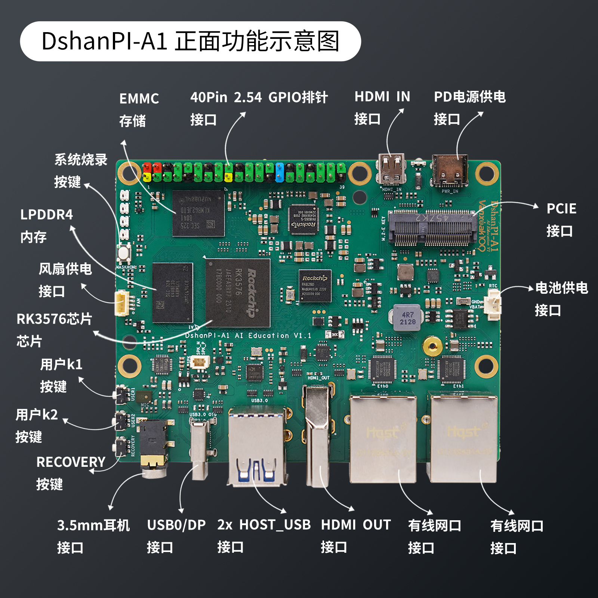
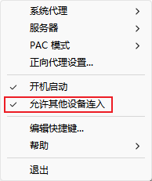
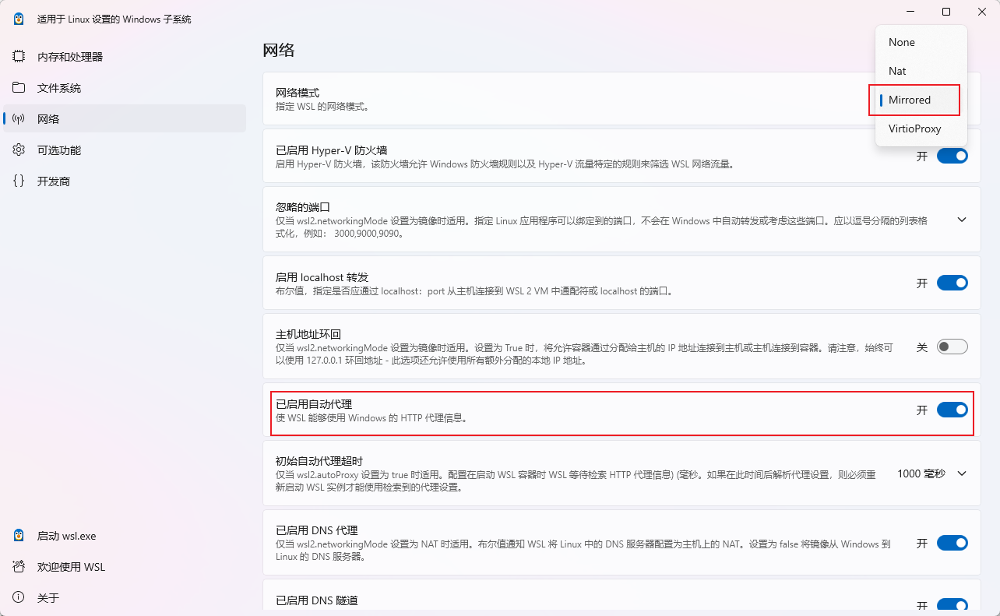
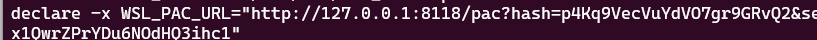
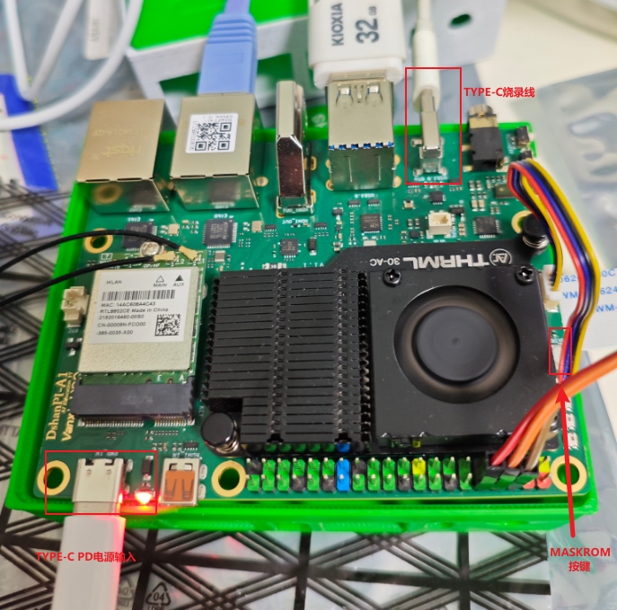
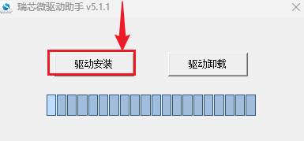
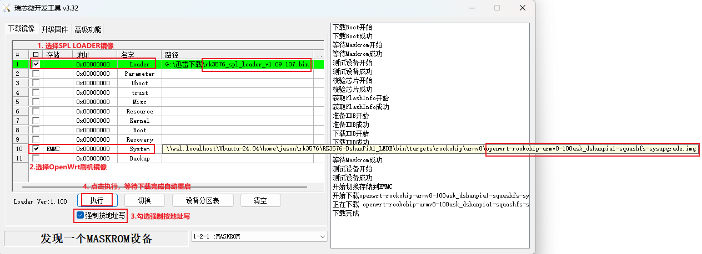
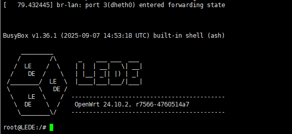

<font style={{color: 'rgb(28, 30, 33)'}}>DShanPl-A1 Education is deeply optimized for artificial intelligence education and project development. Based on Rockchip's RK3576 processor, it integrates 4 Cortex-A72 and 4 Cortex-A53 cores with NEON instruction set support, supports 8K@30fps H.265, VP9 AVS2 and AV1 decoders, 4k@60fps H.264 decoder and 4K@60fps AV1 decoder; it also supports 4K@60fps H.264 and H.265 encoders. The built-in 3D GPU is fully compatible with OpenGl ES1.1/2.0/3.2, 0penCL2.0 and Vulkan 1.1. The embedded NPU computing power reaches up to 6TopS, supporting INT4/INT8/INT16/FP16 mixed operations.</font>



The board has rich peripheral interfaces, and the onboard SOC delivers strong performance, providing a <font style={{color: 'rgb(28, 30, 33)'}}>mid-to-high-end performance SBC (Single Board Computer) experience, smart router, etc. Below are some corresponding application scenario examples:</font>

+ <font style={{color: 'rgb(64, 64, 64)', backgroundColor: 'rgb(252, 252, 252)'}}>Smart standalone mini computer, with office, education, programming development, embedded development and other functions</font>
+ <font style={{color: 'rgb(64, 64, 64)', backgroundColor: 'rgb(252, 252, 252)'}}>Personal git repository, server, NAS, soft router, private cloud</font>
+ <font style={{color: 'rgb(64, 64, 64)', backgroundColor: 'rgb(252, 252, 252)'}}>Robot, drone and other projects</font>
+ <font style={{color: 'rgb(64, 64, 64)', backgroundColor: 'rgb(252, 252, 252)'}}>TV box, smart home hub, home security monitoring, smart speaker and other smart devices</font>

# OpenWrt Introduction
<font style={{color: 'rgb(28, 30, 33)'}}>OpenWrt is an open-source Linux-based embedded operating system, mainly used for network devices such as routers. Compared with traditional router firmware, OpenWrt is not a fixed-function firmware, but a freely extensible software platform. Users can install various components through the opkg package system to implement routing, firewall, VPN, NAS, intranet penetration and many other functions. It provides an SSH command line and LuCI Web interface, with flexible configuration, supporting advanced network features such as VLAN, IPv6, QoS, and multi-WAN. OpenWrt has a clear, modular structure, with the core including the UCI configuration system, netifd network management, dnsmasq, hostapd, and the firewall framework. With its high customizability and strong community support, OpenWrt is suitable for home and enterprise networks as well as secondary development, making it an ideal choice for building high-function routers and network application platforms.  </font>

<font style={{color: 'rgb(28, 30, 33)'}}>Lean's OpenWrt LEDE repository is an open-source project maintained by Lean, aimed at providing stable, efficient and feature-rich support for the OpenWrt system. As a combination of the OpenWrt and LEDE projects, the Lean version provides optimized firmware and enhanced features for a wide range of routers and embedded devices, and is widely used in home, enterprise and laboratory environments. The Lean repository contains numerous patches, optimizations, drivers, and various third-party applications from the global open-source community, greatly enhancing the customizability and performance of the OpenWrt system.</font>

The goal of this project is to build a lightweight NAS (lightweight NAS) application based on the DShanPl-A1 Education single-board. The best implementation path is to adopt the mature and highly extensible open-source routing system OpenWrt LEDE. With OpenWrt's complete Linux environment and rich ecological plugins, we can install storage services, network services, intranet penetration, secure access and other functional modules in the system as needed. Through the collaborative configuration among these plugins, combined with OpenWrt's powerful network management capabilities, a lightweight NAS solution based on a soft router architecture can be built.

# Development Environment
## Environment Description
The official OpenWrt build recommends using the native <font style={{color: 'rgb(51, 51, 51)'}}> </font>[<font style={{color: 'rgb(51, 122, 183)'}}>GNU/Linux environment</font>](https://openwrt.org/docs/guide-developer/toolchain/install-buildsystem)<font style={{color: 'rgb(51, 51, 51)'}}>, but it also supports building using Windows WSL mode. Using a WSL development environment on Windows eliminates the need to configure a virtual machine environment, and can also be used in environments where installing VMware is restricted. Therefore, the author's build and development environment mostly prioritizes using WSL.</font>

WSL (Windows Subsystem for Linux) provides a native-level Linux environment on Windows, suitable for developers to carry out cross-platform or Linux-related project development. Its main advantages include:

1. **Lightweight and fast**<font style={{color: 'rgb(51, 51, 51)'}}>: No virtual machine or dual system is needed. Startup and running are almost as fast as native Linux, with low resource consumption.</font>
2. **Seamless integration with Windows**<font style={{color: 'rgb(51, 51, 51)'}}>: Can directly access the Windows file system, and use Windows tools (such as VSCode, browser) together with Linux tools.</font>
3. **Native Linux experience**<font style={{color: 'rgb(51, 51, 51)'}}>: Supports most Linux commands, package managers, and build tools. You can directly compile, debug, and run services.</font>
4. **Easy to install and maintain**<font style={{color: 'rgb(51, 51, 51)'}}>: One-click installation from the Microsoft Store. System updates and environment switching are very convenient.</font>
5. **Excellent development experience**<font style={{color: 'rgb(51, 51, 51)'}}>: Supports mainstream development environments such as Docker (WSL2), Git, Python, Node.js, C/C++, suitable for embedded, server, network, AI and other fields.</font>
6. **Good cross-platform compatibility**<font style={{color: 'rgb(51, 51, 51)'}}>: Can build Linux-runnable software on Windows, such as compiling OpenWrt, building drivers, generating cross-compiled packages, etc.</font>

<font style={{color: 'rgb(51, 51, 51)'}}>Overall, WSL allows developers to obtain near-native Linux capabilities on Windows at minimal cost, greatly improving efficiency and flexibility. We use VSCode remote access, which makes it very convenient to complete development work.</font>

<font style={{color: 'rgb(51, 51, 51)'}}>Below are some WSL environment configurations that need to be set before building. Copy this part to</font>

## <font style={{color: 'rgb(51, 51, 51)'}}>Environment Variable Configuration</font>
Refer to the official documentation: [Build system setup WSL](https://openwrt.org/docs/guide-developer/toolchain/wsl)

In the WSL environment, in the build user's .bashrc, add the corresponding configuration information according to the instructions below to solve the problem that Windows environment variables are also effective by default in WSL. After this setting, the environment is basically consistent with the native GNU/LINUX environment, and there will be no issues with WSL's import mechanism.

```bash
# GO build configuration, if it cannot be built, open this
#export GO111MODULE=on
#export GOPROXY=https://goproxy.cn

# proxy, replace this with the proxy service IP:PORT of your own Windows environment
export http_proxy=http://192.168.31.50:6080
export https_proxy=http://192.168.31.50:6080

export REPO_URL='https://mirrors.tuna.tsinghua.edu.cn/git/git-repo'

# Filter Windows PATH stuff
export PATH=$(echo $PATH | sed -e 's|:[^:]*WindowsApps[^:]*||g')
export PATH=$(echo $PATH | tr ':' '\n' | grep -v NVIDIA | tr '\n' ':')
export PATH=$(echo $PATH | tr ':' '\n' | grep -v 'Files' | paste -sd ':' -)
export PATH=$(echo $PATH | tr ':' '\n' | grep -v 'VS' | paste -sd ':' -)
export PATH=$(echo $PATH | tr ':' '\n' | grep -v '/mnt/' | paste -sd ':' -)
```

## WSL Network Proxy Settings
Since some tool packages are on GitHub, default network downloads may often fail. We can choose to run the corresponding proxy software on Windows, then enable allowing other devices to connect, and then configure the corresponding http_proxy and https_proxy environment variables in WSL, which can conveniently accelerate GitHub access.

Below are some configuration examples:

1. Proxy software enables LAN device connection



2. Set the network mode to Mirrored in WSL Settings

For more details, please refer to Microsoft's official documentation: [Access network applications with WSL - Mirrored mode networking](https://learn.microsoft.com/zh-cn/windows/wsl/networking#mirrored-mode-networking)




3. After configuration, first run wsl --shutdown, and then restart wsl ubuntu
4. Check whether the environment variable WSL_PAC_URL has been configured successfully. A successful example is as follows:



5. Configure terminal http and https proxies, with automatic PAC filtering

```bash
export http_proxy=$WSL_PAC_URL
export https_proxy=$WSL_PAC_URL
```

> Tips: You can directly write this into the current user's .bashrc, so you don't have to execute the proxy settings every time.
>

# Flashing Test Method
This section introduces the basic method of flashing the LEDE image. You need to master the method of flashing the image in advance. Below is a detailed step-by-step introduction.

## Hardware Connection
<font style={{color: 'rgb(28, 30, 33)'}}>To flash the system image, in addition to the dshanpi-a1 board, you also need to prepare </font>**<font style={{color: 'rgb(28, 30, 33)'}}>TypeC USB cable, 30W PD power adapter</font>**<font style={{color: 'rgb(28, 30, 33)'}}> (recommended to purchase from Weidongshan store), as shown below:</font>



## Install Driver and Flashing Software
The tool packages and image files that need to be downloaded are as follows:

+ **<font style={{color: 'rgb(28, 30, 33)'}}>OpenWrt system image:</font>**<font style={{color: 'rgb(28, 30, 33)'}}> </font>[<font style={{color: 'rgb(46, 133, 85)'}}>DshanPi-A1_OpenWrt_Image</font>](https://dl.100ask.net/Hardware/MPU/RK3576-DshanPi-A1/openwrt-rockchip-armv8-100ask_dshanpia1-squashfs-sysupgrade.7z)<font style={{color: 'rgb(46, 133, 85)'}}> (provided by 100ask)</font>
+ **<font style={{color: 'rgb(28, 30, 33)'}}>Flashing tool RKDevTool:</font>**<font style={{color: 'rgb(28, 30, 33)'}}> </font>[<font style={{color: 'rgb(46, 133, 85)'}}>RKDevTool_Release_v3.32.zip</font>](https://dl.100ask.net/Hardware/MPU/RK3576-DshanPi-A1/RKDevTool_Release_v3.32.zip)
+ **<font style={{color: 'rgb(28, 30, 33)'}}>Driver installation tool package DriverAssitant:</font>**<font style={{color: 'rgb(28, 30, 33)'}}> </font>[<font style={{color: 'rgb(46, 133, 85)'}}>DriverAssitant_v5.1.1.zip</font>](https://dl.100ask.net/Hardware/MPU/RK3576-DshanPi-A1/DriverAssitant_v5.1.1.zip)
+ **<font style={{color: 'rgb(28, 30, 33)'}}>DshanPi-A1 bootloader firmware:</font>**<font style={{color: 'rgb(28, 30, 33)'}}> </font>[<font style={{color: 'rgb(46, 133, 85)'}}>rk3576_spl_loader_v1.09.107.bin</font>](https://dl.100ask.net/Hardware/MPU/RK3576-DshanPi-A1/rk3576_spl_loader_v1.09.107.bin)

<font style={{color: 'rgb(28, 30, 33)'}}>Find the driver installation tool package DriverAssitant_v5.1.1.zip in the previously downloaded materials, extract it, then open and launch the download program DriverInstall.exe, click driver installation, as follows:</font>



Extract the flashing tool RKDevTool_Release_v3.32.zip downloaded from the previous link, and then directly double-click RKDevTool.exe.


## Start Flashing
<font style={{color: 'rgb(28, 30, 33)'}}>After the preparation is complete, follow the steps below to make the device enter the MASKROM flashing mode:</font>

<font style={{color: 'rgb(28, 30, 33)'}}>1. Connect the </font>**<font style={{color: 'rgb(28, 30, 33)'}}>usb2.0/3.0 otg</font>**<font style={{color: 'rgb(28, 30, 33)'}}> cable (i.e., the type-c flashing data cable, the other end of the data cable connects to the computer's USB2.0/3.0 blue port);</font>

<font style={{color: 'rgb(28, 30, 33)'}}>2. Press and hold the </font>`**<font style={{color: 'rgb(28, 30, 33)', backgroundColor: 'rgb(246, 247, 248)'}}>MASKROM</font>**`<font style={{color: 'rgb(28, 30, 33)'}}> button, </font>**<font style={{color: 'rgb(28, 30, 33)'}}>do not release it first</font>**<font style={{color: 'rgb(28, 30, 33)'}}> ;</font>

<font style={{color: 'rgb(28, 30, 33)'}}>3. Then connect the power supply, and the dshanpi-a1 will enter the </font>`**<font style={{color: 'rgb(28, 30, 33)', backgroundColor: 'rgb(246, 247, 248)'}}>MASKROM</font>**`<font style={{color: 'rgb(28, 30, 33)'}}> flashing mode;</font>

<font style={{color: 'rgb(28, 30, 33)'}}>Open the flashing tool, select the interface parameters as below, configure the flashing image and parameters, then click execute, and wait for the download to complete. After flashing is complete, the board will automatically restart, and then the LEDE pixel LOGO will appear, indicating that flashing is complete.</font>





<font style={{color: 'rgb(28, 30, 33)'}}>Note: After OpenWrt compilation is complete, the flashable image will be compressed into a zip format file. You need to perform the decompression operation first before it can be used as the flashing image for the flashing tool. An example is as follows:</font>

```bash
jason@ubuntu24:~/LEDE/bin/targets/rockchip/armv8$ gunzip -k openwrt-rockchip-armv8-100ask_dshanpia1-squashfs-sysupgrade.img.gz -f
gzip: openwrt-rockchip-armv8-100ask_dshanpia1-squashfs-sysupgrade.img.gz: decompression OK, trailing garbage ignored

# Wait for the img image file input
jason@ubuntu24:~/LEDE/bin/targets/rockchip/armv8$ ls -lh openwrt-rockchip-armv8-100ask_dshanpia1-squashfs-sysupgrade.img
-rw-r--r-- 1 jason jason 640M Nov 28 02:24 openwrt-rockchip-armv8-100ask_dshanpia1-squashfs-sysupgrade.img
```

# Reference Documents
+ [100ask DshanPi-A1 Introduction](https://wiki.dshanpi.org/docs/DshanPi-A1/intro/)
+ [100ask OpenWrt System Image Flashing to EMMC](https://wiki.dshanpi.org/docs/DshanPi-A1/OtherSystem/OpenWrt-LEDE/FlasheMMC)
+ [https://openwrt.org/docs/guide-developer/start](https://openwrt.org/docs/guide-developer/start)
+ [openwrt build record - LX2020 - cnblogs](https://www.cnblogs.com/lx2035/p/17961653)


