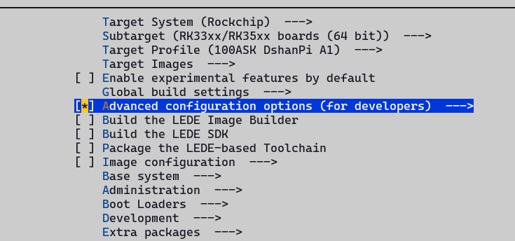
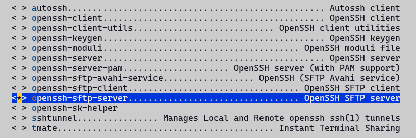
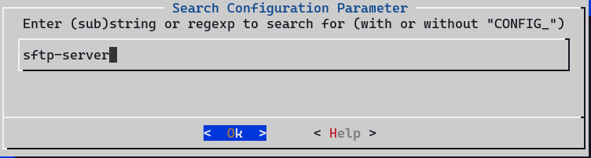
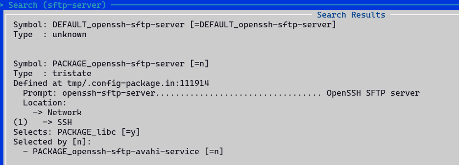
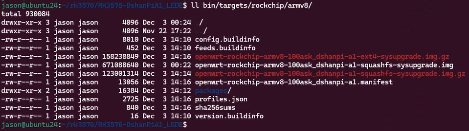

## Preface
<font style={{color: 'rgb(17, 17, 51)'}}>This document aims to provide developers and enthusiasts with a clear, concise OpenWrt (LEDE) firmware build guide, dedicated to the </font>**<font style={{color: 'rgb(17, 17, 51)'}}>DshanPi A1 (based on Rockchip RK3576 platform)</font>**<font style={{color: 'rgb(17, 17, 51)'}}> development board. Through this process, you will complete the complete build process from source code acquisition, dependency updates, configuration customization (including OP domain and Kernel domain), to final firmware generation. The document also covers the minimal configuration generation method, common problem tips, and image output descriptions, helping users efficiently build stable firmware adapted to the hardware, laying the foundation for subsequent development, debugging, or deployment. Whether you are new to OpenWrt compilation or want to perform deep customization for the RK3576 platform, this document can serve as a practical reference.</font>

## Configure the Build Environment
If you are building based on WSL, please refer to the [《1. Board Introduction and Development Environment Setup - Development Environment》](https://www.yuque.com/jason-0nd0f/ts7m5t/dq8nprtdhgq5lk2a#wQtqk) section to configure the WSL basic environment.

Then follow the repository readme to install the build toolchain needed for building. After installing the build-related dependencies, an example is as follows:

```bash
sudo apt install -y ack antlr3 asciidoc autoconf automake autopoint binutils bison build-essential \
bzip2 ccache clang cmake cpio curl device-tree-compiler flex gawk gcc-multilib g++-multilib gettext \
genisoimage git gperf haveged help2man intltool libc6-dev-i386 libelf-dev libfuse-dev libglib2.0-dev \
libgmp3-dev libltdl-dev libmpc-dev libmpfr-dev libncurses5-dev libncursesw5-dev libpython3-dev \
libreadline-dev libssl-dev libtool llvm lrzsz msmtp ninja-build p7zip p7zip-full patch pkgconf \
python3 python3-pyelftools python3-setuptools qemu-utils rsync scons squashfs-tools subversion \
swig texinfo uglifyjs upx-ucl unzip vim wget xmlto xxd zlib1g-dev
```

## Obtain the Source Code
Just git clone the 100ask repository. Note that in some environments GitHub access may be restricted and cloning may fail. You can refer to the content in [《1. Board Introduction and Development Environment Setup - 3.3 WSL Network Proxy Settings》](https://www.yuque.com/jason-0nd0f/ts7m5t/dq8nprtdhgq5lk2a#SD6lh) to configure the http/https terminal proxy.

```bash
git clone https://github.com/dshanpi/RK3576-DshanPiA1_LEDE.git
```

After downloading the source code, update feeds and download the corresponding packages:

```bash
cd RK3576-DshanPiA1_LEDE
./scripts/feeds update -a
./scripts/feeds install -a
```

## Custom Options
After updating feeds, we can first use the default minimal configuration as a base, and then make custom configurations on top of it. An example is as follows:

```bash
cp minimal.config .config
make defconfig # Will automatically fill in missing configuration items to make it a complete compilable configuration
```

Subsequent configurations can be saved as defconfig and added to version control. For the specific method, see the 《4.5 Save Configuration》 section of this document.

After generating the base configuration, you can proceed with custom configuration. The command for custom configuration is:

```bash
make menuconfig
```

The system configuration, simply divided, can be mainly split into the following parts:

+ busybox

This part is the feature configuration of the base system. The base system of OpenWrt uses busybox.

+ app

This part corresponds to some commands or luci-xxx type applications with web pages. It mainly relies on this part to extend the router's functionality and expose easy-to-use configuration interfaces.

+ libs

This part mainly configures the libraries integrated into the OpenWrt system, which can be added as needed. Under normal circumstances, when certain commands or luci-type apps are selected, the corresponding libraries will be automatically selected.

+ kernel

This part mainly configures the kernel, including some kernel features and drivers. When there is new peripheral support, it needs to be configured here.

### Configure Build Options
This part mainly configures some optimization parameters when building target files and some options for the build toolchain. Open it according to the following method:

1. First enable Advanced configuration options (for developers):



2. Enable Target Options, and fill in the target optimization GCC build parameters:


3. Enable Toolchain Options, and configure the toolchain options:


> Warning: The C library implementation here must be musl, otherwise after flashing and entering the system, all packages downloaded via Opkg will not be usable! (Because the default packages are all musl C library)!
>

### Configure busybox Options
In some scenarios, OpenWrt's non-busybox configuration cannot cover the requirements and needs to be implemented through packages inside busybox. In this case, you need to customize the busybox options. You can refer to the following configuration method:

1. Select Base System -> Customize busybox options


Among them, Settings are some additional parameter configurations, such as build options; Applets are configurations for command-line tools. We just need to make the corresponding configurations as needed.

Note that when OpenWrt's packages can provide the corresponding functionality, we should not provide it again in the busybox configuration. Otherwise, in the final stage of building, an error message will be prompted indicating that it is already provided but also exists in Busybox.

### Configure Applications
OpenWrt contains a rich set of applications that can greatly enrich the router's functionality, including various libraries, command-line tools, and GUI apps (commonly referred to as plugins). Here we only provide some configuration examples for common apps.

Most packages are arranged in an orderly alphabetical order under each major category by classification. For example, if we want to enable sftp-server, we can find it under: Network -> SSH page, and then select it. An example is as follows:



There is also a quicker method. Through the menuconfig configuration item search function, you can quickly locate the page to be configured and select it. Below is an example of the search method targeting sftp-server:

1. In the menuconfig main interface, type / to enter the search page, and then enter sftp-server in the search page



2. According to the number index corresponding to (N) in the search result page, you can quickly jump to a certain result. For example, if there is only one result here, then the index is 1. Typing 1 directly will jump to the corresponding page.



3. You can see that the package corresponding to the current search page is =n, not enabled; after typing the index value to jump over, it is indeed not enabled. Correspondingly, at this time we only need to type y to enable it.


4. For cases with multiple search results, we can use the spacebar to turn pages and view results, or use the up and down keys to view results line by line. By viewing the detailed information on the search page, we can determine whether it is the package we are looking for.

> Note: It is recommended to use both methods flexibly, which can greatly speed up development efficiency.
>

### Configure kernel Options
The kernel configuration options are different from others. They are not configured by make menuconfig, but have a separate make target. An example is as follows:

```bash
make kernel_menuconfig
```

When the entire project has not been built before, executing the above command will automatically build the dependent toolchain first, which may be time-consuming. It is recommended to build the entire project once first, and then customize the kernel options.

Because the first time the entire project is built, all dependent source packages will be downloaded and the corresponding toolchain will be built, which is quite time-consuming.

### Save Configuration
For the OP domain configuration, use the following command to generate the minimal configuration file:

```bash
./scripts/diffconfig.sh > defconfig
```

For the kernel domain configuration, when configuring the kernel, the configuration will be automatically updated to the config file under target, so there is no need to save it manually.

## Build
### Process
First perform the download operation, resolve any problems that may be encountered during the download process, and then execute the build process.

Avoiding downloads during the default build process is because if a certain package fails, when building again, it will check one by one whether the previous packages have been downloaded and built. This is not conducive to debugging. Execute the command as follows:

```bash
# When the download fails, use -j1 to view the specific failure information
# The downloaded source packages are all stored in the dl directory under the project root directory
make download -j$(nproc)

# The first build is recommended to use single thread, testing multi-thread builds may fail!
make V=s -j1
```

For the second build, you can execute:

```bash
make V=s -j$(nproc)
```

If you need to reconfigure, follow the process below:

```bash
rm -rf .config
make menuconfig
make V=s -j$(nproc)
```

### Common Build Errors
Some programs will fail during building. At this time, we need to re-run using make V=s -j1 to better see the errors during the build process. Common ones include undefined or library-not-found errors, or errors caused by Werror. Below is a simple example of a solution.

For example, when initially using glibc for building, mbedtls and vlmcsd kept failing to build. Adding the following modifications allowed them to build:

```diff
diff --git a/package/libs/mbedtls/Makefile b/package/libs/mbedtls/Makefile
index 4e0a4a034..54a0b2d45 100644
--- a/package/libs/mbedtls/Makefile
+++ b/package/libs/mbedtls/Makefile
@@ -121,7 +121,7 @@ This package contains mbedtls helper programs for private key and
 CSR generation (gen_key, cert_req)
 endef
 
-TARGET_CFLAGS += -ffunction-sections -fdata-sections
+TARGET_CFLAGS += -ffunction-sections -fdata-sections -Wno-error=stringop-overflow
 TARGET_CFLAGS := $(filter-out -O%,$(TARGET_CFLAGS))
 
 CMAKE_OPTIONS += 
```

```diff
--- Makefile.orig       2025-11-14 01:58:43.376952312 +0800
+++ Makefile    2025-11-14 01:53:50.865983762 +0800
@@ -37,4 +37,6 @@
        $(INSTALL_BIN) ./files/vlmcsd.ini $(1)/etc/vlmcsd/vlmcsd.ini
 endef
 
+TARGET_LDFLAGS += -lresolv -lpthread
+
 $(eval $(call BuildPackage,vlmcsd))
```

For more errors during the build process, flexibly use AI tools and search engines, and you can basically solve the problems encountered in building.

## Flashing
After the build is complete, two types of image packages will be generated in the corresponding bin/target/xxxx directory: one is ext4 and the other is squashfs. If you need to restore default configuration, you need to use the squashfs image package.



<font style={{color: 'rgb(28, 30, 33)'}}>Note: After OpenWrt compilation is complete, the flashable image will be compressed into a zip format file. You need to perform the decompression operation first before it can be used as the flashing image for the flashing tool. An example is as follows:</font>

```bash
jason@ubuntu24:~/LEDE/bin/targets/rockchip/armv8$ gunzip -k openwrt-rockchip-armv8-100ask_dshanpia1-squashfs-sysupgrade.img.gz -f
gzip: openwrt-rockchip-armv8-100ask_dshanpia1-squashfs-sysupgrade.img.gz: decompression OK, trailing garbage ignored
```

After decompressing to get the img image, refer to 《[Board Introduction and Development Environment Setup - 4.3 Start Flashing](https://www.yuque.com/jason-0nd0f/ts7m5t/dq8nprtdhgq5lk2a)》 for flashing.

The OpenWrt system's built-in online flashing function has problems when used. Refer to the 《[Existing Feature Optimization - 1.3 sysupgrade image cannot be used](https://www.yuque.com/jason-0nd0f/ts7m5t/hru38u3g3erf1yuv#G6G2J)》 section for adaptation. After adaptation, you can directly flash via the web method. An example is as follows:


> Note: The image package selected for web page online upgrade is the compressed image package!
>
