After downloading the officially adapted OpenWrt source code from 100ask, I found that many features were not fully adapted, causing some poor user experience during use. Below is a record of the problems I found during use and an analysis of the solutions, hoping to give readers some ideas for solving similar problems. Since my knowledge is limited, if there are any errors, you are welcome to discuss.

## Installing third-party ipk does not work
The libc of the default cloud mirror repository uses musl. After flashing with glibc, I found that all installed programs could not be used. The default OpenWrt uses musl libc.

## Installing third-party fdisk does not work
With the default busybox configuration, many tools are missing. After installing fdisk through opkg, it prompts that a certain library does not exist. You need to manually configure the Busybox options. We turn on the custom busybox options, then enable fdisk.

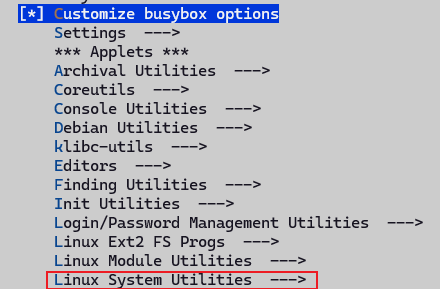

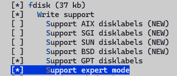

Then recompile the image and flash it. After testing, you can find that fdisk works now.

## sysupgrade image does not work
When using the default generated sysupgrade image, in the interface [System - Backup / Upgrade - Flash new firmware image], after selecting the compiled firmware, I found it could not be used, with the following error print messages:

```bash
Tue Dec  2 17:27:21 2025 user.info upgrade: Device 100ask,dshanpi-a1 not supported by this image
Tue Dec  2 17:27:21 2025 user.info upgrade: Supported devices: 100ask,dshanpia1
Tue Dec  2 17:27:21 2025 user.info upgrade: Reading partition table from bootdisk...
Tue Dec  2 17:27:22 2025 user.info upgrade: Reading partition table from image...
Tue Dec  2 17:27:22 2025 user.info upgrade: Device 100ask,dshanpi-a1 not supported by this image
Tue Dec  2 17:27:22 2025 user.info upgrade: Supported devices: 100ask,dshanpia1
Tue Dec  2 17:27:22 2025 user.info upgrade: Reading partition table from bootdisk...
Tue Dec  2 17:27:22 2025 user.info upgrade: Reading partition table from image..
```

After checking, I found that the device name defined in armv8.mk is inconsistent with the compatible in the dts, causing sysupgrade to refuse flashing.

OpenWrt sysupgrade will read:

1. The identifier of the currently running device:

From:

    - `/proc/device-tree/compatible`
    - `/etc/board.json`
2. The supported_devices list embedded in the firmware

If any character of the two does not match, it reports: `Device XXX not supported by this image`

Now that we know the problem, the fix is simple. Modify as follows:

1. Modify target/linux/rockchip/image/armv8.mk to keep it consistent with the dts


2. Re-run make menuconfig, select the target, and the .config file will be updated automatically

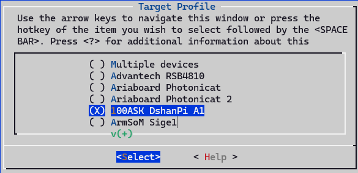

3. Re-run make V=s -j8 to build the image.

## sftp does not work
By default, dropbear is used as the ssh server, which does not have sftp functionality. Here we modify the configuration, turn off dropbear, and then enable openssh under **Network -> SSH**, as shown below.

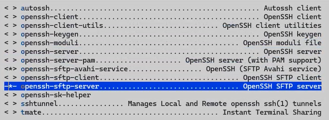

The build fails, `openssh-sk-helper` build depends on `libfido2`. We manually enable this library, select it as y, then recompile.

Note: openssh-server and openssh-server-pam cannot be enabled at the same time. We just enable the build without PAM support.

## rootfs space is too small
We prefer to flash the squashfs format image, which makes it convenient to restore factory configuration, because the rom in squashfs format is based on overlayfs, and updated configurations will not directly modify the content in the rom. However, we can find that the default configured rootfs size is relatively small, while the onboard EMMC has 58G. We can expand the rootfs space to 8G, and allocate the remaining space as a separate partition.

The default configured rootfs partition is 512M, as shown below:


Modify the configuration, set the default rootfs partition size to 2G, modify the Rootfs partition size configuration under Target Images, as shown below:

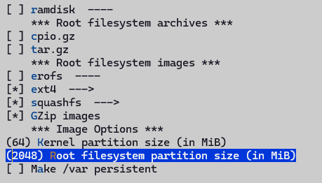

## USB device cannot be recognized
When we simply enable usb0 and usb1 in the device tree, we find that USB drives can be recognized, but during the usb driver probe, it prints that dr_mode is forcibly set to host. Looking at the code, we find that the default configuration is otg, but there is no corresponding otg configuration, and the drd-related code is not compiled.


We need to modify the device tree file to enable the usb0 and usb1 controllers, with the default role as host. Enable the DRD ROLE SWITCH feature, then you can dynamically configure the controller role, and you can also specify the default role.

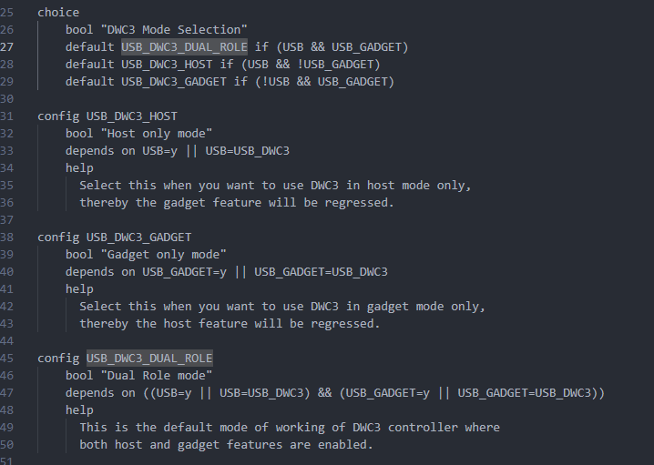

You must enable USB Gadget to enable the dual-role function, so we turn it on, then select Dual Role mode in Mode Selection. This will generate the usb_role sysfs node in the kernel, which can be dynamically configured as host or peripheral. On the DshanPi A1, usb1 is fixed as host, and usb0 can be configured as dual-role and can be switched. So we make the following dts configuration:


```diff
--- a/target/linux/rockchip/files/arch/arm64/boot/dts/rockchip/rk3576-100ask-dshanpi-a1.dts
+++ b/target/linux/rockchip/files/arch/arm64/boot/dts/rockchip/rk3576-100ask-dshanpi-a1.dts
@@ -770,6 +770,20 @@
        status = "okay";
 };
 
+// usb0 as type-c port, can be host or peripheral.
+&usb_drd0_dwc3 {
+       status = "okay";
+       usb-role-switch;
+       role-switch-default-mode ="host";
+};
+
+// usb1 as type-a port, fixed to host
+&usb_drd1_dwc3 {
+       status = "okay";
+       usb-role-switch;
+       role-switch-default-mode ="host";
+};
+
 &uart0 {
        pinctrl-0 = <&uart0m0_xfer>;
        status = "okay";
```

After configuration, usb1 can be used, but usb0 cannot. And the onboard Hynetik HUSB311 Type-C chip can provide USB PD and USB Type-C functionality. We found that the default 6.12 kernel version driver does not support this chip. Checking the official rockchip repository, there is support for this chip, which needs to be ported over. We temporarily don't need the DP function, so we mask it out.

## PWM fan always runs at maximum speed
After power on, the fan always runs at maximum speed, which is quite loud. We need to modify it to support automatic speed adjustment based on temperature, which is more suitable for common application scenarios. The troubleshooting record is as follows:

### Check hardware
The fan uses the Raspberry Pi 5 4-pin fan, which is a standard 4-pin JST connector. The physical photo and schematic are as follows:


<span className="text-content">The fan connector is a 1mm pitch JST SH socket with four pins:</span>

| **<span className="text-content">PIN Number</span>** | **<span className="text-content">Function</span>** |
| --- | --- |
| <span className="text-content">1</span> | <span className="text-content">+5V</span> |
| <span className="text-content">2</span> | <span className="text-content">PWM</span> |
| <span className="text-content">3</span> | <span className="text-content">GND</span> |
| <span className="text-content">4</span> | <span className="text-content">Speed</span> |


After checking the manual, pin 2 is connected to PWM1, and pin 4 is connected to the fan speed port, which means it does not support reading the speed, and can only control the speed via PWM. Looking at the schematic, it is PWM1_CH0, and there is a corresponding configuration in the dts. Searching the driver according to the compatible field "pwm-fan", I found that the file linux-6.12.43/drivers/hwmon/pwm-fan.c exists but was not compiled. That means the KCONFIG was not selected, and the pwm-fan driver was not compiled.

### Enable PWM driver
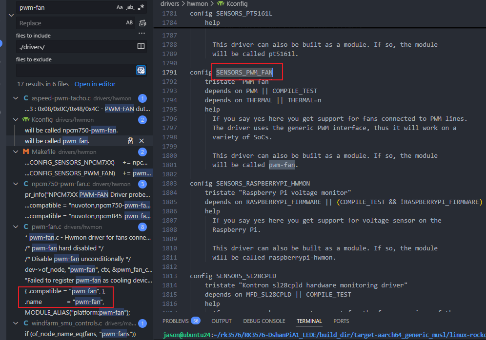

So we directly run make kernel_menuconfig, search for CONFIG_SENSORS_PWM_FAN, then enter the number corresponding to the search result, and it will jump directly to the corresponding configuration location. Just enter Y to enable it.


After compiling and flashing, during the boot process, I found that the pwm-fan driver failed to start, with the following print:


It can be concluded that the upstream PWM device was not found. Searching the compatible of the referenced node, I found that the corresponding driver was not enabled, in a separate directory: drivers/soc/rockchip

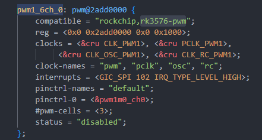

The enabled drivers:


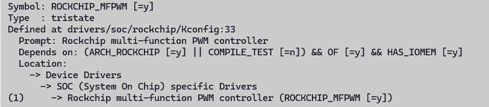

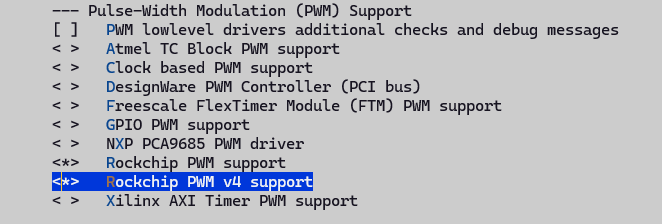

After enabling, there will be compilation issues. We modify as follows:


Modify as follows:

```diff
--- a/include/soc/rockchip/utils.h	2025-11-23 03:35:07.695086227 +0800
+++ b/include/soc/rockchip/utils.h	2025-11-23 03:34:43.946599951 +0800
@@ -50,6 +50,7 @@
  *
  * Return: the value, shifted into place, with the required write-enable bits
  */
+#if 0
 #define REG_UPDATE_WE(_val, _low, _high) ( \
 	BUILD_BUG_ON_ZERO(const_true((_low) > (_high))) + \
 	BUILD_BUG_ON_ZERO(const_true((_high) > 15)) + \
@@ -57,6 +58,11 @@
 	BUILD_BUG_ON_ZERO(const_true((u64) (_val) > U16_MAX)) + \
 	((_val & GENMASK((_high) - (_low), 0)) << (_low) | \
 	(GENMASK((_high), (_low)) << 16)))
+#else
+#define REG_UPDATE_WE(_val, _low, _high) ( \
+	((_val & GENMASK((_high) - (_low), 0)) << (_low) | \
+	(GENMASK((_high), (_low)) << 16)))
+#endif
 
 /**
  * REG_UPDATE_BIT_WE - update a bit with a write-enable mask
@@ -68,9 +74,14 @@
  *
  * Return: a value with bit @__bit set to @__val and @__bit << 16 set to ``1``
  */
+#if 0
 #define REG_UPDATE_BIT_WE(__val, __bit) ( \
 	BUILD_BUG_ON_ZERO(const_true((__val) > 1)) + \
 	BUILD_BUG_ON_ZERO(const_true((__val) < 0)) + \
 	REG_UPDATE_WE((__val), (__bit), (__bit)))
+#else
+#define REG_UPDATE_BIT_WE(__val, __bit) ( \
+	REG_UPDATE_WE((__val), (__bit), (__bit)))
+#endif
 
 #endif /* __SOC_ROCKCHIP_UTILS_H__ */

```

### Method to configure speed
The method to manually configure pwm-fan: find the pwm-fan directory under sysfs, enter /sys/class/hwmon/hwmon0/, and you can see two files pwm1_enable and pwm1. First configure pwm1 to 100, and observe whether the fan noise decreases. The experiment found that it indeed became quieter, which means the PWM control took effect.

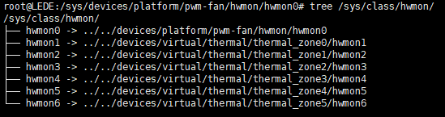

```bash
root@LEDE:~# ls /sys/class/hwmon/hwmon0/
device       of_node      pwm1         subsystem
name         power        pwm1_enable  uevent
root@LEDE:~# echo 100 > /sys/class/hwmon/hwmon0/pwm1
```

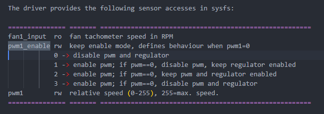

Reference documents:

+ Documentation/hwmon/pwm-fan.rst
+ Documentation/devicetree/bindings/hwmon/pwm-fan.yaml
+ Documentation/driver-api/thermal/sysfs-api.rst

You can also find pwm-fan through the cooling_device under the thermal framework. Under the thermal cooling device framework, there is a registered sysfs interface, corresponding to the ops provided by the pwm_fan driver binding. The state value corresponds to the index of the cooling_levels array configured in the dts, so you can configure the corresponding relative speed in the pwm driver by configuring a value from 0..max_state, directly in the shell.

```c
static const struct thermal_cooling_device_ops pwm_fan_cooling_ops = {
	.get_max_state = pwm_fan_get_max_state,
	.get_cur_state = pwm_fan_get_cur_state,
	.set_cur_state = pwm_fan_set_cur_state,
};

//dts
fan: pwm-fan {
    status = "okay";
    compatible = "pwm-fan";
    #cooling-cells = <2>;
    pwms = <&pwm1_6ch_0 0 50000 1>;

    // This corresponds to states from 0..5
    cooling-levels = <0 100 125 150 200 255>; 

    // The trips configured here did not take effect. We need to put them into the thermal framework
    rockchip,temp-trips = <
        40000    1
        50000    2
        60000    3
        65000    4
        70000    5
    >;
};
```

```bash
root@LEDE:~# ls /sys/class/thermal/cooling_device0/
cur_state  max_state  power      subsystem  type       uevent
root@LEDE:~# cat /sys/class/thermal/cooling_device0/max_state 
5
# This is equivalent to echo 100 > /sys/class/hwmon/hwmon0/pwm1
root@LEDE:~# echo 1 > /sys/class/thermal/cooling_device0/cur_state 
```

### Add automatic speed adjustment feature
Automatic speed adjustment relies on the thermal system, mainly consisting of thermal_zone, cooling_device, and trip_point.

Reference article: [Linux Thermal Framework Analysis - CSDN Blog](https://blog.csdn.net/Linux_zhicheng/article/details/119361850)

Add the corresponding trip under the thermal_zones node configured in the original dts.

~~Compiling dts separately failed~~

```bash
make target/linux/prepare V=s
make target/linux/compile DTBS=1 V=s
```

Then you can directly find the generated:

```c
build_dir/target-*/linux-*/linux-*/arch/arm64/boot/dts/*.dtb
```

When configuring pwm1 or cur_state=0, the fan speed is maximum. According to the kernel documentation about the pwm_fan sysfs node, the specific behavior when pwm1=0 can be configured via the pwm1_enable file. The default value is 1, i.e., disable pwm, keep regulator enabled. So when set to 0, it will directly go to full speed.

So when we configure the cooling-levels array, we set the value of the 0th element to 10, so that it rotates at a lower speed. Then set pwm1_enable to 2, which means when pwm=0, both pwm and regulator still have output, i.e., duty cycle 0.

## Onboard LED has no driver
This is a **RGB LED strip chain controlled by single-wire serial**:

+ Chip: **WS2812C-2020**
+ Number of LEDs: **4 (RUN × 4)**
+ Each LED is both an RGB LED and integrates a driver chip
+ Only **1 GPIO digital signal line** is needed to control a string of LEDs

Typical uses:

+ Status light
+ Marquee light
+ Motherboard lighting
+ Industrial control indicator light
+ Router/TV box breathing light

 WS2812 uses **single-wire 800kHz NRZ protocol, not ordinary PWM**. The Linux kernel cannot bit-bang fast enough directly, and must use something that can generate precise waveforms to drive it.


By searching the source code, I found that the project provides two drivers: one is leds-ws2812b, and the other is ws2812-pio-rp1. After careful inspection, I found that one is based on SPI, and the other is based on the PIO expansion chip method. ~~In our schematic, we can only use the spi hacking method.~~

The configuration method refers to the redmi configuration, just adapt it to dshanpi.

The PIN in the schematic does not have MOSI function, so SPI HACKING cannot be used. After consultation, we need to use the PWM HACKING method.

## MMC driver frequently prints errors
Driver error messages:

```bash
[ 1344.988178] mmc0: Timeout waiting for hardware interrupt.
[ 1344.988672] mmc0: sdhci: ============ SDHCI REGISTER DUMP ===========
[ 1344.989235] mmc0: sdhci: Sys addr:  0x00000002 | Version:  0x00000005
[ 1344.989800] mmc0: sdhci: Blk size:  0x00007200 | Blk cnt:  0x00000002
[ 1344.990364] mmc0: sdhci: Argument:  0x00069e72 | Trn mode: 0x0000003f
[ 1344.990929] mmc0: sdhci: Present:   0x03f700f1 | Host ctl: 0x00000035
[ 1344.991493] mmc0: sdhci: Power:     0x0000000d | Blk gap:  0x00000000
[ 1344.992057] mmc0: sdhci: Wake-up:   0x00000000 | Clock:    0x0000030f
[ 1344.992621] mmc0: sdhci: Timeout:   0x0000000e | Int stat: 0x00000000
[ 1344.993185] mmc0: sdhci: Int enab:  0x03ff000b | Sig enab: 0x03ff000b
[ 1344.993749] mmc0: sdhci: ACmd stat: 0x00000000 | Slot int: 0x00000000
[ 1344.994313] mmc0: sdhci: Caps:      0x3a6dc881 | Caps_1:   0x08000007
[ 1344.994876] mmc0: sdhci: Cmd:       0x0000123a | Max curr: 0x00000000
[ 1344.995439] mmc0: sdhci: Resp[0]:   0x00000900 | Resp[1]:  0xfff6dbff
[ 1344.996003] mmc0: sdhci: Resp[2]:   0x320f5903 | Resp[3]:  0x00009001
[ 1344.996566] mmc0: sdhci: Host ctl2: 0x0000380f
[ 1344.996957] mmc0: sdhci: ADMA Err:  0x00000060 | ADMA Ptr: 0x00000000fc300210
[ 1344.997581] mmc0: sdhci: ============================================

```

Probe information in dmesg:

```plain
[ 0.438699] mmc0: SDHCI controller on 2a330000.mmc [2a330000.mmc] using ADMA 64-bit
[ 0.499319] mmc0: new HS400 Enhanced strobe MMC card at address 0001
[ 0.500422] mmcblk0: mmc0:0001 CJNB4R 58.2 GiB
[ 0.502009] mmcblk0: p1 p2 p3
[ 0.502655] mmcblk0boot0: mmc0:0001 CJNB4R 4.00 MiB
[ 0.503828] mmcblk0boot1: mmc0:0001 CJNB4R 4.00 MiB
[ 0.504873] mmcblk0rpmb: mmc0:0001 CJNB4R 4.00 MiB, chardev (247:0)
```

Based on AI search and the information in the DTS, it can be seen that the eMMC works completely normally during the power-on initialization stage. The controller registers/clock/reset/pinctrl are basically fine, otherwise it would not have successfully switched to HS400 ES and recognized partitions.

We can try downgrading to HS200 or reducing the frequency for testing, to find a stable working version. I tested two methods locally:

1. Downgrade to HS200, without changing frequency

```c
mmc-hs200-1_8v;
//mmc-hs400-1_8v;
//mmc-hs400-enhanced-strobe;
```

After testing, HS200 works fine, boot print:

```plain
[    0.439179] mmc0: SDHCI controller on 2a330000.mmc [2a330000.mmc] using ADMA 64-bit
[    0.492249] mmc0: new HS200 MMC card at address 0001
[    0.493187] mmcblk0: mmc0:0001 CJNB4R 58.2 GiB
[    0.494771]  mmcblk0: p1 p2 p3
[    0.495416] mmcblk0boot0: mmc0:0001 CJNB4R 4.00 MiB
[    0.496586] mmcblk0boot1: mmc0:0001 CJNB4R 4.00 MiB
[    0.497629] mmcblk0rpmb: mmc0:0001 CJNB4R 4.00 MiB, chardev (247:0)

```

2. Keep HS400 unchanged, reduce frequency to 100M

```c
//max-frequency = <200000000>;
max-frequency = <100000000>; //work perfect on 100M
```

After testing, it also works normally, boot print:

```plain
[    0.439264] mmc0: SDHCI controller on 2a330000.mmc [2a330000.mmc] using ADMA 64-bit
[    0.492185] mmc0: new HS400 Enhanced strobe MMC card at address 0001
[    0.493275] mmcblk0: mmc0:0001 CJNB4R 58.2 GiB
[    0.494696]  mmcblk0: p1 p2 p3
[    0.495331] mmcblk0boot0: mmc0:0001 CJNB4R 4.00 MiB
[    0.496498] mmcblk0boot1: mmc0:0001 CJNB4R 4.00 MiB
[    0.497546] mmcblk0rpmb: mmc0:0001 CJNB4R 4.00 MiB, chardev (247:0)
```

But I found that when using docker, there are various error prints:


So I'll use the minimal modification method: remove the HS400 mode configuration in the device tree and set the HS200 mode. Testing shows stable operation, so I'll use this for now.

