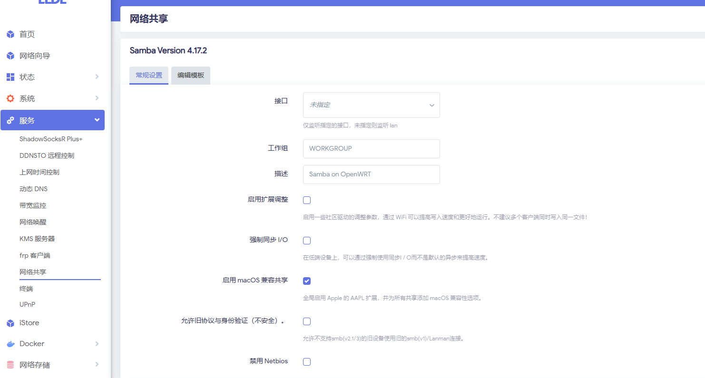
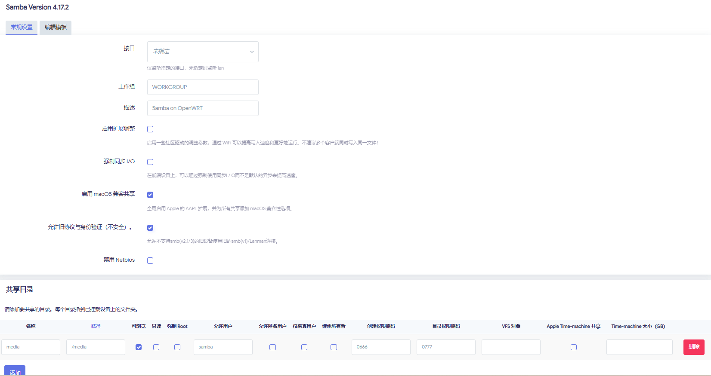
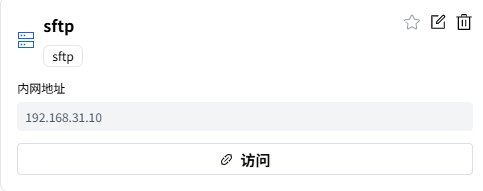
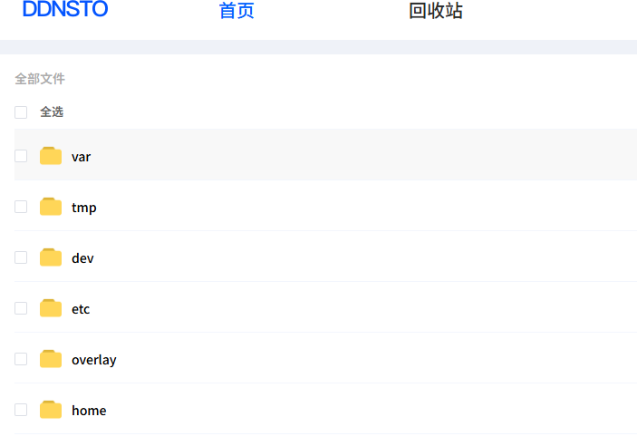
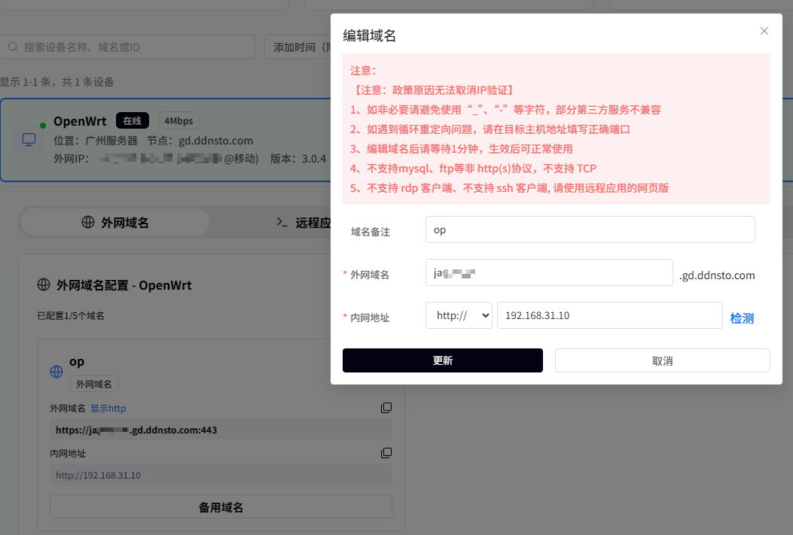
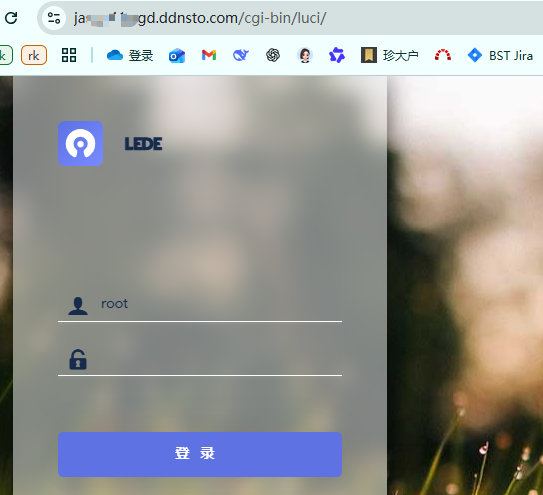

## Solution Introduction and Selection
Making the lightweight NAS (LAN file sharing) on OpenWrt accessible from the external network means being able to securely access your home storage from anywhere. This is the simplest way to set up a self-built private cloud. You only need the development board to have a USB interface, USB 3.0 is better, and then you can connect a USB portable hard drive, turning it into an OpenWrt device with lightweight NAS functionality. Below is the analysis of the implementation steps.

## File Sharing
We first need to implement the LAN file sharing function. Below are the recommended methods for common LAN sharing scenarios. Here we choose samba4, FileBrowser, and webDAV, supporting all three common sharing methods. Below are the recommended protocols for specific scenarios, which you can flexibly choose according to your own scenario.

| Scenario | Recommended Protocol |
| --- | --- |
| **Windows + Linux general file sharing** | Samba4 |
| **Linux server mount (e.g., Docker/K8s)** | NFS |
| **External network access to NAS (with frp/Tailscale)** | FileBrowser (Web) |
| **Most secure transfer (requires encryption)** | SFTP |
| **iPhone/macOS mount network drive** | WebDAV |
| **Media player (TV, DLNA)** | Samba4 or NFS |


## Intranet Access
After completing the LAN network sharing, to implement a lightweight NAS, there is another key feature: being able to remotely view the shared files at home at any time. Then we need to implement intranet penetration. Below are common intranet penetration methods and their corresponding pros and cons. We choose to use frp (self-built relay server) and the now-popular method DDNSTO. The former requires you to have a public network server for data forwarding, while the latter is easy to operate: you only need to install the corresponding plugin, then bind your device on the Yiyouyun platform, and the Yiyouyun service provider's server will do the data forwarding.

Below is a comparison of common intranet access solutions:

| Solution | Pros | Cons | Security |
| --- | --- | --- | --- |
| ✅ **Public IP + Port Mapping** | Simple direct connection, fast | Requires public IP (ISPs generally don't provide) | Low (requires firewall) |
| 🌐 **DDNS + Public IP** | Suitable for dynamic IP users | Also requires public network access | Medium |
| 🔐 **ZeroTier / Tailscale VPN** | No public IP needed, automatically penetrates NAT | Requires third-party VPN control plane | High |
| ☁️ **frp / Cloudflare Tunnel** | Self-built tunnel, no public IP needed | Depends on intermediate server | High |
| **DDNSTO Router Remote** | Simple operation, no public IP needed | Depends on third-party service provider | High |


Here we prioritize using the DDNSTO plugin + the plugin provider's cloud service to implement intranet penetration for the lightweight NAS application. You can also self-build an frp cloud service on your own VPS to implement intranet penetration for the lightweight NAS application (suitable for advanced users, requires configuring many parameters and some network knowledge, of course you can also ask AI to generate the corresponding configuration). You can choose the solution that suits you according to your actual situation.

# Implementing Lightweight NAS Application with DDNSTO Plugin
## Mount Hard Drive
First, we need to insert the portable hard drive into the USB TYPE-A port of DshanPi A1, then configure the corresponding mount directory, and set it to automatically mount on every boot. Here we use a USB flash drive for the test example; the configuration method for a portable hard drive is exactly the same.

First, on the **System -> Mount Points** page, configure the directory for automatic disk mounting, and enable it.


After configuration, restart the device and observe whether the configuration remains valid after power off. If it takes effect, you can see the following print:


Default permissions of /media:


## Enable File Sharing Service
### Samba Sharing
<font style={{color: 'rgb(64, 64, 64)', backgroundColor: 'rgb(252, 252, 252)'}}>Samba is a free software that implements the SMB protocol on Linux systems. We can use terminal devices that support the SMB protocol to implement file sharing within the LAN.</font>

#### <font style={{color: 'rgb(64, 64, 64)', backgroundColor: 'rgb(252, 252, 252)'}}>Install Samba</font>
<font style={{color: 'rgb(64, 64, 64)', backgroundColor: 'rgb(252, 252, 252)'}}>First, we need to select luci-app-samba4 before compiling, or install the samba4 server program into the system by installing ipk online after flashing. After installation, on the page: </font>**<font style={{color: 'rgb(64, 64, 64)', backgroundColor: 'rgb(252, 252, 252)'}}>Services -> Network Shares</font>**<font style={{color: 'rgb(64, 64, 64)', backgroundColor: 'rgb(252, 252, 252)'}}> you can see the corresponding configuration, as shown below:</font>



#### <font style={{color: 'rgb(64, 64, 64)', backgroundColor: 'rgb(252, 252, 252)'}}>Create Samba User</font>
<font style={{color: 'rgb(64, 64, 64)', backgroundColor: 'rgb(252, 252, 252)'}}>When performing network sharing, we should avoid using the root user to log in to the samba server. To this end, we separately create a user for accessing the samba server and grant it access permissions to the folder.</font>

Open **Services -> Terminal**, execute the following commands to create a user, and grant the user access permissions to the shared directory.

```bash
#Add a user named samba
useradd samba

#Create an smb service password for user samba, this is separate from the user's login password, they can be different
smbpasswd -a samba

#Grant user samba access to the shared directory
#Note: Only ext4 file systems can modify permissions, make corresponding adjustments according to your disk format
chown -R samba:samba /media/
```

Modify /etc/passwd to configure the samba user so it cannot log in. Below is an example:


#### Modify samba4 Configuration
<font style={{color: 'rgb(64, 64, 64)', backgroundColor: 'rgb(252, 252, 252)'}}>Open </font>**<font style={{color: 'rgb(64, 64, 64)', backgroundColor: 'rgb(252, 252, 252)'}}>Services -> Network Shares</font>**<font style={{color: 'rgb(64, 64, 64)', backgroundColor: 'rgb(252, 252, 252)'}}> to configure parameters.</font>

<font style={{color: 'rgb(64, 64, 64)', backgroundColor: 'rgb(252, 252, 252)'}}>Select the interface as lan, so that intranet devices can access it. Check</font><font style={{color: 'rgb(64, 64, 64)', backgroundColor: 'rgb(252, 252, 252)'}}> </font>**<font style={{color: 'rgb(64, 64, 64)', backgroundColor: 'rgb(252, 252, 252)'}}>Allow legacy protocols and authentication.</font>**

<font style={{color: 'rgb(64, 64, 64)', backgroundColor: 'rgb(252, 252, 252)'}}>Click</font><font style={{color: 'rgb(64, 64, 64)', backgroundColor: 'rgb(252, 252, 252)'}}> </font>**<font style={{color: 'rgb(64, 64, 64)', backgroundColor: 'rgb(252, 252, 252)'}}>Add</font>**<font style={{color: 'rgb(64, 64, 64)', backgroundColor: 'rgb(252, 252, 252)'}}> </font><font style={{color: 'rgb(64, 64, 64)', backgroundColor: 'rgb(252, 252, 252)'}}>an entry.</font>

+ <font style={{color: 'rgb(64, 64, 64)', backgroundColor: 'rgb(252, 252, 252)'}}>Name: The folder name displayed when sharing, can be set freely, here set to media</font>
+ <font style={{color: 'rgb(64, 64, 64)', backgroundColor: 'rgb(252, 252, 252)'}}>Path: The folder path to be shared, here set to the directory mounted in the previous chapter</font>`<font style={{color: 'rgb(64, 64, 64)', backgroundColor: 'rgb(252, 252, 252)'}}>/media</font>`<font style={{color: 'rgb(64, 64, 64)', backgroundColor: 'rgb(252, 252, 252)'}}></font>
+ <font style={{color: 'rgb(64, 64, 64)', backgroundColor: 'rgb(252, 252, 252)'}}>Allowed users: Users with access permissions, here set to the user samba just created.</font>

<font style={{color: 'rgb(64, 64, 64)', backgroundColor: 'rgb(252, 252, 252)'}}>These are the main settings. Save and apply these configurations. For other settings, you can explore other advanced configurations on your own.</font>



### SFTP Sharing
#### Install SFTP Server
Dropbear does not support SFTP, but it supports calling an external sftp-server.

OpenWrt already provides a standalone `openssh-sftp-server` package:

```bash
opkg update
opkg install openssh-sftp-server
```

After installation, sftp-server will be placed at: `/usr/lib/sftp-server`. This solution is suitable for scenarios where you need a GUI to configure ssh keys but also need sftp server functionality. If you replace everything with the full OpenSSH suite, since OpenSSH has no official LuCI configuration interface in OpenWrt, all configurations would have to be done through the terminal.

#### Configure SFTP
After installation, you can use it directly without other configuration. For example, connecting directly with Xftp, you can see the files in the system.

### WebDAV Sharing
After installing the DDNSTO plugin, it comes with a lightweight webdav service built in. You don't need to install it separately, just use it directly.


## Configure Intranet Penetration
First, log in to the DDNSTO console. After registering and logging in, record the user Token, then configure the DDNSTO remote control page on the board side, configuring the corresponding parameters. An example is as follows:


### Configure Samba Remote Access
Log in to the DDNSTO console. Under the File Management section, click Add File Management to add a Samba protocol file management service. Fill in the corresponding parameters. An example is as follows:

1. Add configuration


2. Click Connect
3. Enter the user and password from the Samba4 configuration
4. Connection successful, you can see the files in the corresponding directory, as shown below:


### Configure SFTP Remote Access
Log in to the DDNSTO console. Under the File Management section, click Add File Management to add an Sftp protocol file management service. Fill in the corresponding parameters. An example is as follows:

1. Add configuration


2. Click Access



3. Enter the username and password that can log in via ssh, here enter the password for root
4. Connection successful, you can see the files in the corresponding directory, as shown below:



### Configure WebDAV Remote Access
Log in to the DDNSTO console. Under the File Management section, click Add File Management to add a webdav protocol file management service. Fill in the corresponding parameters. An example is as follows:

1. Add configuration


2. Click Access


3. Enter the authorized username and password filled in the DDSNTO plugin in the router system to the login page


4. Connection successful, you can see the files in the corresponding directory, as shown below:


### Configure Remote Access to Router Backend
Log in to the DDNSTO console, select the External Domain section, then click Add Domain, and fill in the configuration according to the example below:



After configuration, click the External Domain section to jump directly to the external domain page. This way you can remotely configure the router in the LAN from anywhere.



To summarize: The DDNSTO plugin integrates many remote scenarios. For light use, the paid 4Mbps plan is sufficient, with low latency, saving you from various complex environment setup processes and the cumbersome process of self-building a VPS. Recommended!

# Self-build Frp Cloud Service to Implement Lightweight NAS Application
## Mount Hard Drive and Enable File Sharing Service
The mounting of the hard drive and enabling of the file sharing service in the self-built solution are exactly the same as the DDNSTO plugin method. For detailed steps, please refer to the content in the previous chapter, which will not be repeated here.

## Configure Intranet Penetration Service
There are many parameters to configure here, and security needs to be considered. There are many configuration items and certificate steps involved. Due to space limitations, it will not be described in detail here. For more information, please refer to frp's official documentation to set up the corresponding intranet penetration service.

