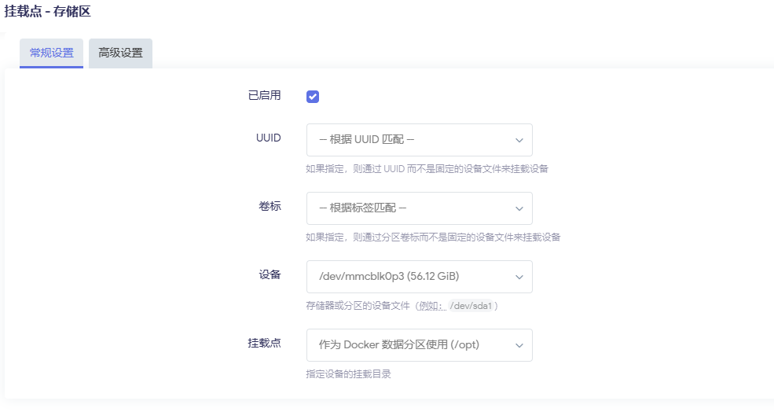
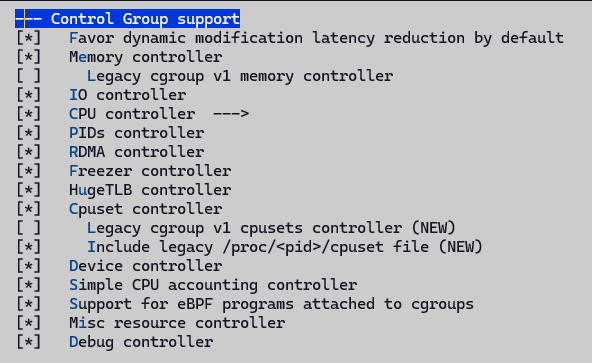
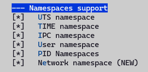
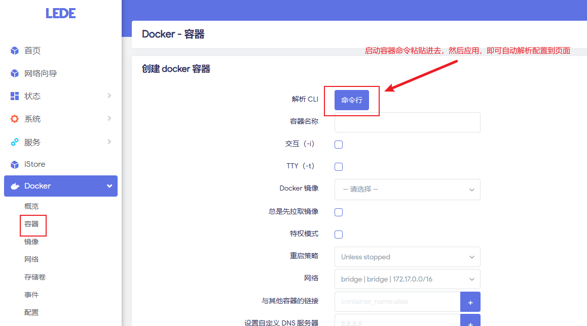
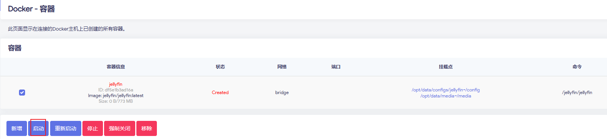
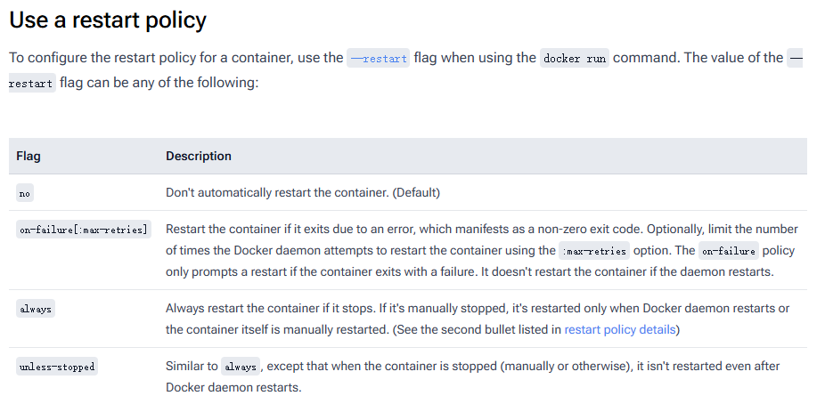
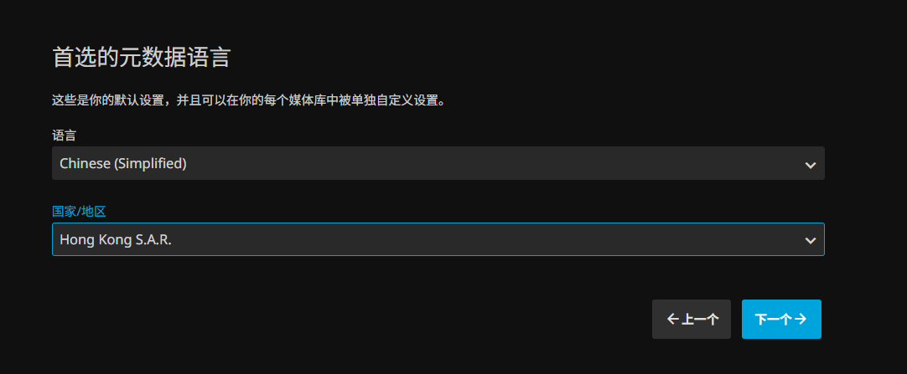
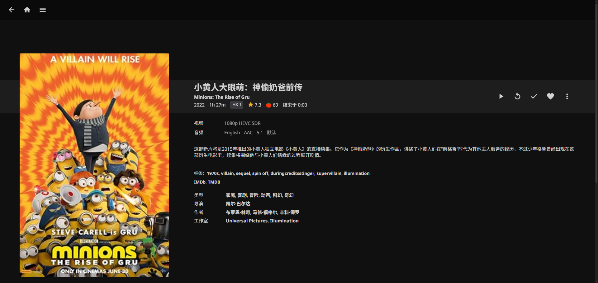
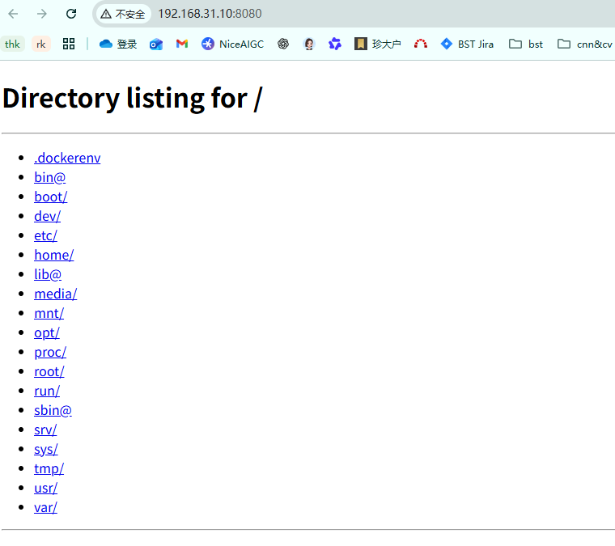
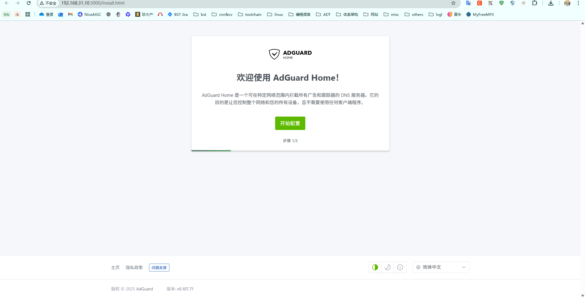

 Docker is an open-source containerization platform that encapsulates applications and their runtime environments through "containers", enabling applications to run quickly and stably across different systems. Containers are lightweight, start fast, and consume few resources, making them suitable for microservice deployment and continuous integration/delivery. Docker also provides image management, version control, and environment consistency, keeping development, testing, and production environments unified, greatly improving deployment efficiency and portability. Docker allows developers to package their applications and dependencies into a lightweight, portable container, then publish to any popular Linux machine, and can also implement virtualization.

Hardware environment: OpenWrt runs on a high-performance ARM SBC (such as the Dshanpi-A1 used in this article), with common home devices like an optical modem + switch/AC/AP.  
Goal: Use Docker on this SBC to run **home theater + downloader + network drive + ad filtering + simple monitoring**, one machine for multiple uses.

# Topology & Environment Description
## Home Network
+ Optical modem in bridge mode, delegating PPPoE dialing to OpenWrt on the ARM SBC
+ ARM SBC serves both as the main router and as a "lightweight NAS + home theater server"
+ TV box, mobile phone, and computer are all connected to the LAN (wired or wireless), uniformly accessing services on the SBC

## Machine Configuration
+ **Device**: ARM 64-bit architecture SBC, 8G memory version
+ **System**: OpenWrt (self-compiled/integrated firmware both work, the key is to have Docker)
+ **Disk**:
    - System disk (eMMC/TF) for OpenWrt
    - External SSD/HDD/large USB drive as data disk, mounted to `/mnt/data`

# Docker Environment & Directory Planning
First confirm the environment and directory planning, which makes maintenance easier later. This step is critical.

## Install Docker / Docker Compose
If your firmware already has Docker packaged, you can skip the installation. It is recommended to install luci-app-dockerman, which is a dedicated Docker Web management interface plugin for OpenWrt:

```bash
opkg install luci-lib-docker dockerd luci-lib-jsonc docker ttyd --force-depends
opkg install luci-app-dockerman
```

+ `dockerd`: Docker daemon
+ `docker`: Command-line client
+ `luci-lib-docker` / `luci-lib-jsonc`: Dockerman dependencies
+ `ttyd`: For Web terminal and container console
+ `luci-app-dockerman`: Web management interface plugin

Start and set to auto-start on boot:

```bash
/etc/init.d/dockerd start
/etc/init.d/dockerd enable
```

Then access the LuCI backend, and the menu will have an additional: **Services / Docker** or **Services / Dockerman**.

You can also confirm the environment works via command line, as shown below:

```bash
root@LEDE:~# docker version
Client:
 Version:           28.0.4
 API version:       1.48
 Go version:        go1.25.4
 Git commit:        b8034c0
 Built:             Sun Sep  7 14:53:18 2025
 OS/Arch:           linux/arm64
 Context:           default

Server:
 Engine:
  Version:          28.0.4
  API version:      1.48 (minimum version 1.24)
  Go version:       go1.25.4
  Git commit:       6430e49
  Built:            Sun Sep  7 14:53:18 2025
  OS/Arch:          linux/arm64
  Experimental:     false
 containerd:
  Version:          1.7.27
  GitCommit:        
 runc:
  Version:          1.2.6
  GitCommit:        
 docker-init:
  Version:          0.19.0
  GitCommit:        de40ad0
root@LEDE:~# docker ps
CONTAINER ID   IMAGE     COMMAND   CREATED   STATUS    PORTS     NAMES
root@LEDE:~# 
```

Seeing the version information & empty container list means it's OK.

`docker-compose` is also recommended to install for managing multiple services together later (taking ARM64 as an example):

```bash
wget https://github.com/docker/compose/releases/download/v2.27.0/docker-compose-linux-aarch64 -O /usr/local/bin/docker-compose
chmod +x /usr/local/bin/docker-compose
docker-compose version
```

## Data Disk Mount & Directory Planning
First, create a new partition in the remaining eMMC space, format it as ext4, then mount it on the interface as the docker data partition. Of course, you can also use other external storage devices, such as a TF card as the docker data partition, just add the corresponding mount directory configuration. An example is as follows:



With the data disk rooted at /opt/data, you can plan it like this:

```plain
/opt/docker      # Docker root directory (images, container layers, etc.)
/opt/data
   ├─ media      # Media files (movies, TV series, music)
   │   ├─ movies
   │   └─ tv
   ├─ downloads  # BT/PT download directory
   └─ configs    # Configuration files for each container
       ├─ jellyfin
       ├─ qbittorrent
       └─ ...
```

Then create the directories:

```bash
mkdir -p /opt/data/{configs,downloads,media}
mkdir -p /opt/data/configs/{jellyfin,emby,transmission,qbittorrent,aria2,adguard,nextcloud}
mkdir -p /opt/data/media/{movies,tv,anime,music}
mkdir -p /opt/data/downloads/{bt,aria2,tmp}
```

Later, all containers should try to be mounted under `/opt/data` to avoid filling up the system disk.

Benefits of doing this:

+ If a container breaks, just delete and rebuild it, data is unaffected
+ When changing devices, just connect this disk over and modify the path to continue using it

## Configure Kernel Options to Support Docker
With the default compiled kernel, docker will have warning messages when running, prompting that certain feature support is missing, as shown below:


 These WARNINGs indicate that your **kernel has not enabled the cgroup v1/v2 resource limit functions**, causing Docker to be unable to limit CPU, IO, memory swap, etc. for containers.  We need to enable the following configurations in our system:

```bash
# Open the kernel configuration page
make kernel_menuconfig
```

According to the configuration below, enable CGroup and Namespace support:






Recompile, then upgrade. After booting, confirm there are no corresponding error messages. For more configuration support, please check the configuration in the code repository.

Note: Some docker versions require enabling legacy cgroup v1 related control support. Keep this disabled here.

## Acceleration Source Configuration
1. When installing the docker images below, the default repository download may fail. You can configure mainland sources to accelerate downloads;


Common acceleration mirror site addresses:

```json
{
  "registry-mirrors": [
    "https://docker.1panel.live",
    "https://registry.docker-cn.com",
    "http://hub-mirror.c.163.com",
    "https://docker.m.daocloud.io"
  ]
}
```

2. If you find that the configured acceleration source is inaccessible, it may be due to the installed openwrt proxy plugin. Modify the configuration or disable the proxy and retry;
3. After configuration, run `docker pull hello-world` to check whether the image can be pulled normally. If it can, the network configuration is complete. Below is an example of normal operation overview:


# Common Use Cases
## Jellyfin Home Theater (Emby/Plex work the same way)
Note: The following uses command-line and illustrated methods for operation examples. Subsequent chapters only provide command-line examples.

###  Pull Image
Execute on the command line:

```bash
# [--platform linux/arm64] is an optional parameter, can be removed
docker pull --platform linux/arm64 jellyfin/jellyfin:latest
```

LuCI interface operation:


After pulling successfully, you can see it in the image list on the page, as shown below:


### Start Container
Start command example:

```bash
docker run -d \
  --name=jellyfin \
  --restart=unless-stopped \
  -p 8096:8096 \
  -v /opt/data/configs/jellyfin:/config \
  -v /opt/data/media:/media \
  jellyfin/jellyfin:latest
```

You can directly copy the above command, go to the Parse CLI on the interface, click the command line button, then paste, and finally click Apply.



After adding, the page shows the status as Created. At this point, select the jellyfin container, then click Start:



If the SBC supports hardware decoding (and GPU drivers are set up), you can try adding:

```bash
--device /dev/dri:/dev/dri
```

> Hardware decoding on ARM platforms is an advanced topic with many pitfalls. If it works, consider it a bonus; if not, just use pure software decoding, 1080p is generally fine.
>

Startup parameter description:



### Web Configuration Process
Browser access: `http://router-IP:8096`

1. Create admin account


2. Add media library:
    - Movies → `/media/movies`
    - TV Series → `/media/tv`
    - Anime → `/media/anime`


3. Select Simplified Chinese for the language, and the metadata source can be switched to Chinese priority (smoother scraping)



After that, you can:

+ Install Jellyfin client on Android TV/TV box
+ Access directly via web/client on phone, tablet, PC
+ All terminals in the home use this ARM SBC "mini server" as the server

### Usage Introduction
After the initial configuration above is completed, jellyfin is initialized. We log in with the configured admin account and can see the following interface:


I had previously downloaded the Minions movie source via a magnet link, and now I can click to watch it online directly.

The movie has no information by default. We can scrape metadata to get cover and other information. For more use cases, please refer to jellyfin's official documentation:




## Core Use Case 2: Run Ubuntu
Many services depend on a complete ubuntu environment rather than the OpenWrt plugin approach. In such cases, we can install a docker ubuntu container in the OpenWrt environment to have an environment similar to native ubuntu, enabling various custom features. Below is an example of a basic Python-implemented web server, demonstrating the powerful customization capability of running a containerized version of ubuntu.

### Pull Image
Execute command:

```bash
docker pull ubuntu:24.04
```

### Start Container
```bash
docker run -it ubuntu:24.04 bash
```

Command-line start example:

```bash
docker run -it -d \
  --name ubt-web \
  --restart=unless-stopped \
  -p 8080:8000 \
  ubuntu:24.04 \
  bash
```

Enter the container and execute simple HTTP server Python code, as shown below:

```bash
docker exec -it ubt-web bash
apt update
apt install python3 python3-pip -y

cat > /srv/app.py << 'EOF'
from http.server import HTTPServer, SimpleHTTPRequestHandler

PORT = 8000
httpd = HTTPServer(("", PORT), SimpleHTTPRequestHandler)
print(f"Serving on port {PORT}...")
httpd.serve_forever()
EOF

# The web server root implemented above is the path where python3 is currently executed
python3 /srv/app.py

```

### Web Access Test
At this point, access the http server written in python in the ubuntu container via `http://router-IP:8000`, and a file list will appear, as shown below:



## Bonus Use Case: Network-wide Ad Blocking
First, pull the adguardhome image:

```bash
docker pull adguard/adguardhome:latest
```

Then start the container, using AdGuard Home: network-wide DNS ad blocking

```bash
docker run -d \
  --name=adguardhome \
  --restart=unless-stopped \
  -p 3000:3000 \
  -p 53:53/tcp \
  -p 53:53/udp \
  -v /opt/data/config/adguard:/opt/adguardhome/conf \
  -v /opt/data/config/adguard/work:/opt/adguardhome/work \
  adguard/adguardhome
```

+ Initialization address: `http://router-IP:3000`



+ After configuration, in OpenWrt's LAN DHCP, point the DNS to the adguardhome container's port 53, thereby implementing DNS-based ad filtering.

For more configuration details, please refer to the AdGuard Home official documentation.

# FAQ / Pitfalls Summary
**Q1: How to set up external network access?**

+ Recommended: Use ZeroTier/Tailscale/FRP for intranet penetration, try not to expose ports directly on the public network

**Q3: How to do backups?**

+ Essential: the entire `/opt/data/config` directory (configuration of all services)
+ Important data: `/opt/data/media` and downloads to keep
+ When changing machines, just connect this disk over, remount, and modify the container paths to continue using it

**Q4: How to troubleshoot issues?**

+ `docker logs container-name` to view logs
+ `docker exec -it container-name /bin/sh` to enter the container for troubleshooting
+ Check basic items like mount directory permissions, disk space, memory usage

# Reference Links
+ [Docker Tutorial](https://www.runoob.com/docker/docker-tutorial.html)

